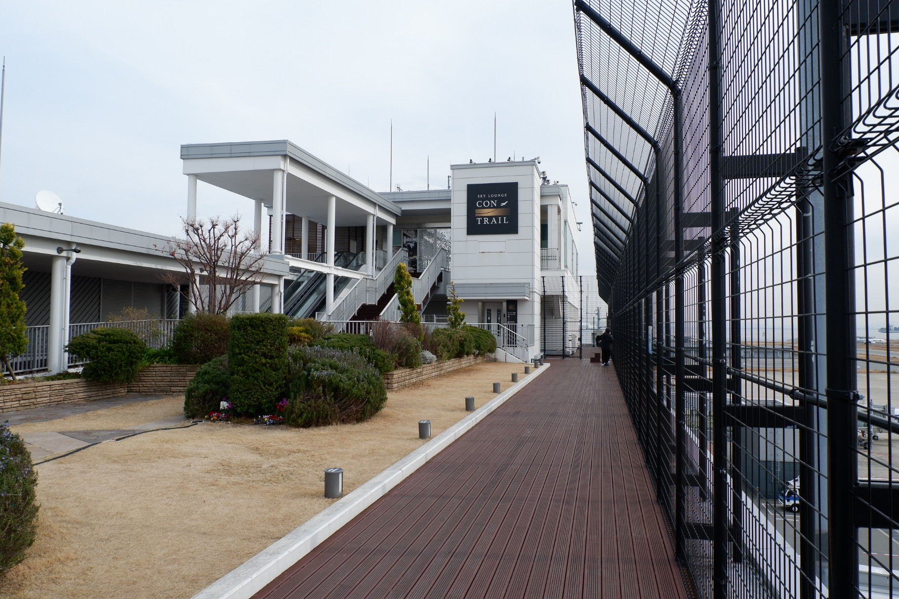
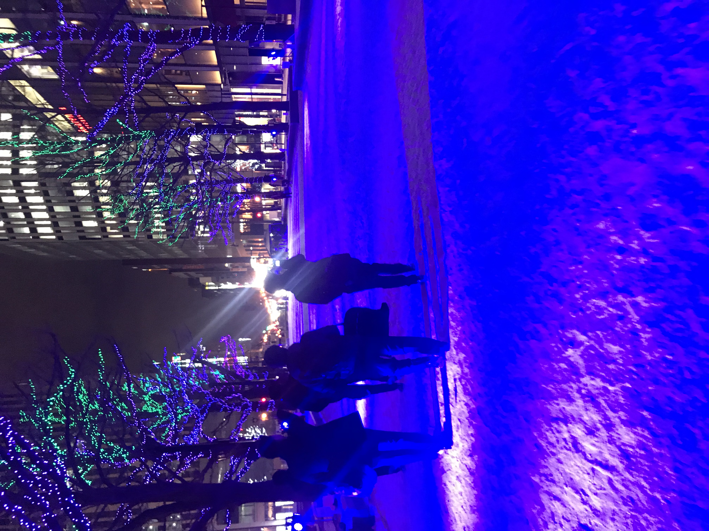
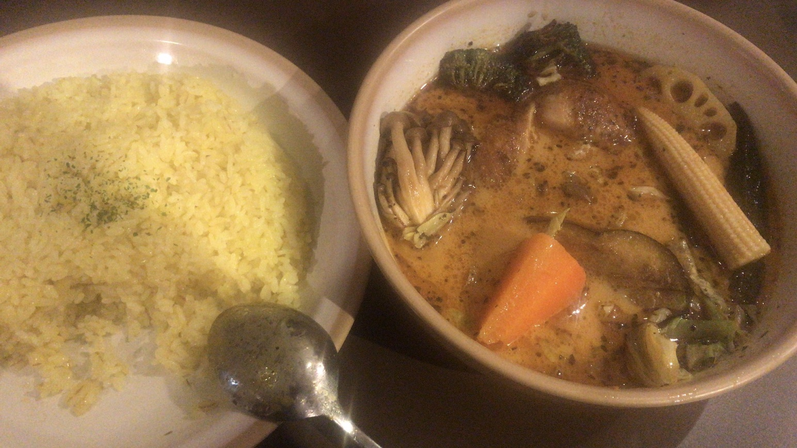

# 2020.1.14 周二

今日出发至札幌。早上吃了昨天晚上买的三碗杯面，都是酱油味道，感觉并不是很好吃。不过量还是蛮大的。

退房很简单，交了卡就好了。之后要坐到神户机场坐飞机。神户机场，顾名思义在神户（废话）。感觉神户、京都、奈良就像大阪的三个卫星城，坐JR只要半个多小时就到了。

神户机场似乎也是填海出的机场，沿途会经过一个小岛，令人惊讶的是似乎也有很多人在这里上班，这个倒是蛮好玩的。因为唯一进出岛的方法就是那一条高速路（要是丧尸爆发就非常难以逃生）。

神户机场好小…跟闹着玩似的。全部的办理业务柜台、托运就只有不到十个窗口。不过办手续还是很迅速的（这么小当然迅速好吗）。机场很漂亮！二层是出发层，三层是吃饭的地方，四层是一个观景台，可以看到飞机起飞的地方。这个真的很酷。

看了一会飞机打算吃点饭，他们机场的饭很便宜（其实也就和外面一样），而且味道还不错。我们吃了拉面，不知道是所有的拉面都是这样还是怎么，他们的拉面口感很funny，像糯米做的。不过我觉得还可以，徐徐觉得不是很好吃。

坐飞机啦，日本飞机上的规矩和国内差不多。不过有很多日本人都把包放在座位底下而不是抱着。快到新千岁机场的时候就可以远远的看见北海道的山脉了，从飞机上可以望到下面的雪，像蒙德里安的画作，只不过一块一块的白色和墨绿色。

出新千岁机场后坐上前往札幌的JR。一整节车厢基本上都是大陆人和台湾人（台湾人真的说话声音好大，口音又很好玩…）JR在地上行驶，可以看到沿途的雪景。当地人自己的房子会涂成各种各样有趣的颜色，远远的一眼望去就像乐高堆出来的。虽然身处异国他乡，但是脑海里浮现的却是“北国风光，千里冰封，万里雪飘”。

确实也是很久没看过这样的雪了，这雪也不同于东北的雪。在这样的建筑和语言中，感觉着实是不同的。来的飞机上在看一本关于宗教信仰与科学的书籍，在这雪中也有点顿悟。想来应是越往北就越接近主的所在，或许第一批前往北极的人也有这样的私心？这种看起来可以延伸到星球最远端的雪，在雪中如蚍蜉一般的人，确实也会认为有更高级的存在在俯视、创造和倾听。

到达札幌，真的好冷，风刮的脸疼。所幸酒店离JR站不是很远。在札幌的住所要稍大一点，有一个可以看到外面的窗户，还有一个小阳台（不过太冷了没有上去）。房间里是很暖和的！房间不能穿鞋进入，要在门外换拖鞋。不得不说日本人真的爱干净（希望我们家以后也这样，还能少打扫）

晚上5点钟出发去吃汤咖喱。这是天已经黑了，还飘着一点小雪。札幌的夜景真美，不知道是不是因为日本过年的缘故，街边都有挂着灯链，配着雪花有一种圣诞的感觉。汤咖喱在一家叫汤咖喱king的店吃，到这家店的时候耳朵和脸已经被风刮的生疼了，一进店眼睛全被蒸汽糊住。店里人不是很多，点了两份鸡肉蔬菜汤咖喱，我要的5分辣，徐徐要的3分辣。

上 菜 了！有一说一，这是我在日本吃过最好吃的一顿。喝下第一口汤的时候脑海中所有的声音都停了，时间在此刻凝固，然后所有的器官都放松了下来。辣椒的味道随后就来，本来放松下来的各个组织触电的一样弹起来冲上跑步机开始飞奔。我的味觉像脱缰的野狗，我的手无情的将一团团米饭泡浸咖喱，肆无忌惮的吞下。咀嚼是不可能咀嚼的，没有这个时间，这份美味必须即刻享受。就好像一个三十年的老光棍看见了一个裸体的绝世美女，前戏是不可能存在的。

就在我以为对这道菜已经了如指掌的时候，我吃下了一块鸡肉。主啊，我相信你的存在。我为我浅薄的思想感到羞耻，是什么给了我自信让我愚蠢的以为明白了这道料理的真谛。我永远也不会明白，我只能慢慢的靠近。这鸡肉在咖喱中浸泡许久，但它的表皮依然保持着脆脆的口感，肉质有着被被充分烤过的芬芳。只有鸡腿中的至强者才经受得起这样的考验。这鸡腿就是鸡腿界的斯巴达，这汤咖喱就是日料界的亚历山大大帝。

也不知道发生了什么，面前的菜就被吃光了。伟大真的只在一瞬间。徐徐好像因为太好吃而有点胃部不适。我们休息了一下，买单后就准备去李小璐（划掉）狸小路逛一逛。

狸小路和心斋桥很像，但比那里小一点，也没有那里有那么多店。大概转了转又觉得很疲惫，我们就启程返回了。返回的时候我没有找到公交卡，结果回家才发现就在裤兜里只不过没摸到…札幌的车票很有趣，买出来不是站名，而是多少钱的，可以坐到所有这个钱数的站台。车票就小小的一条，挺有意思。

晚上在罗森买了草莓大福，泡了泡澡。今天虽然感觉没什么事情，不过确实有些疲惫了。札幌很美也很好吃，北海道真的是太棒（美味）了！

