# 2020.1.12 周日

环球影城之日！

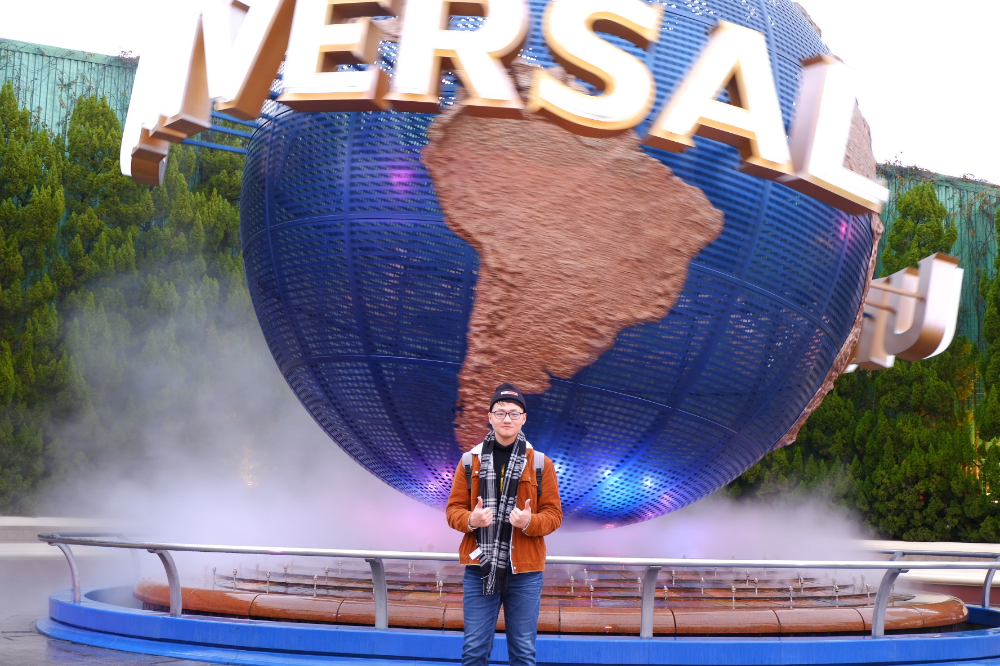

又是早起的一天！早上6:50起床了，昨天在全家买了早点，饭团和面包。早上在酒店吃了一点就出发了，地铁只需要半个小时，比上海的迪士尼好很多哦。地铁上基本都是去环球影城的，也有很多是日本的游客。到环球的时候是八点左右，已经在门口排了很多队伍了。开门的时候就远远的看见飞奔的人群，他们都是前往哈利波特园区排队的（尊贵的快速票会员笑而不语）。影城是不允许带水和食物的，但是安检的小姐姐很好，她看见了也会叮嘱你不要拿出来（赞！）。

进入了世界上最快乐的地方！我们首先去蜘蛛侠排队，快速票上只可以选蜘蛛侠或者侏罗纪公园，但是我们都想玩，于是先去排蜘蛛侠！因为很早所以几乎没有怎么排队就玩到了。即使是排队的时候，旁边的陈设都好好玩！模拟了Peter Parker的编辑室，到处挂的都是J·J·詹姆森的大头照。蜘蛛侠是16个人一个小车，我以为会让一起来的游客单独坐一排，但他们把所有的座都填满了（sad）。很好玩！不得不说加上这个ip简直太酷了，还可以体验蜘蛛侠荡来荡去的感觉。

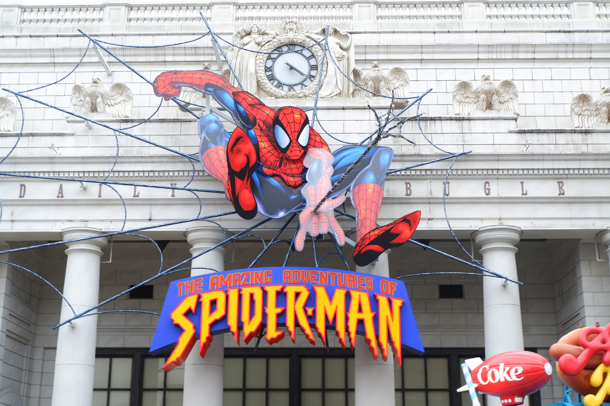

游玩出来才9点，由于10:50才可以进哈利波特的园区，我们又去排队看了欢乐好声音（名字十分像一个国内的选秀节目）。这是一场舞台演出，9:30开始。还是比较有意思的，好像参与了一场小电影（小动画电影）。所幸在开始前排队的前导视频有英文字幕，不然真的有点不太知道是什么……

接下来有一段真空期，史努比那个园区对我们来说有些太幼稚了，而其他的设施感觉时间不是很够。我本来想去拍照片，可是徐徐有些困了（太能睡了），于是在史努比的一个游玩房间里面小睡了一会（在世界上最快乐的地方睡觉），而我默默的在旁边守护（同时吃掉了一个饭团）。

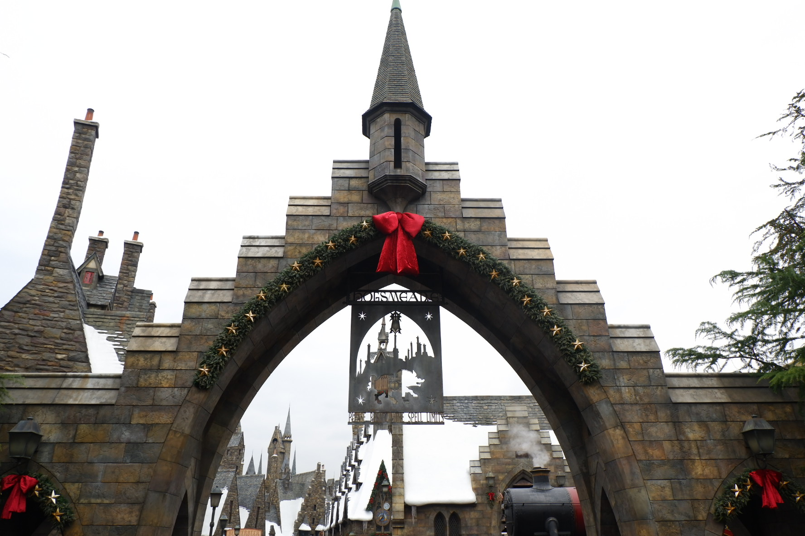

前往哈利波特园区！真的好赞哦！进入园区要走过一段阴森的森林小路（禁忌森林！）。然后就会看见小镇的大门，哥特式的建筑，上面还积攒着雪花和冰凌。我们在园区里转了转，拍了些照片，买了两根churritos，感觉有点太甜了。喝了黄油啤酒，也是甜甜的感觉。园区内有很多穿着巫师袍的游客，在进入环球影城的时候就看见很多人带着格兰芬多的围巾（好酷）。园区内还有很多买了魔杖的游客在特定的地点施法，看到了一个小孩很快速的就学会了阿拉霍洞开，so cool！

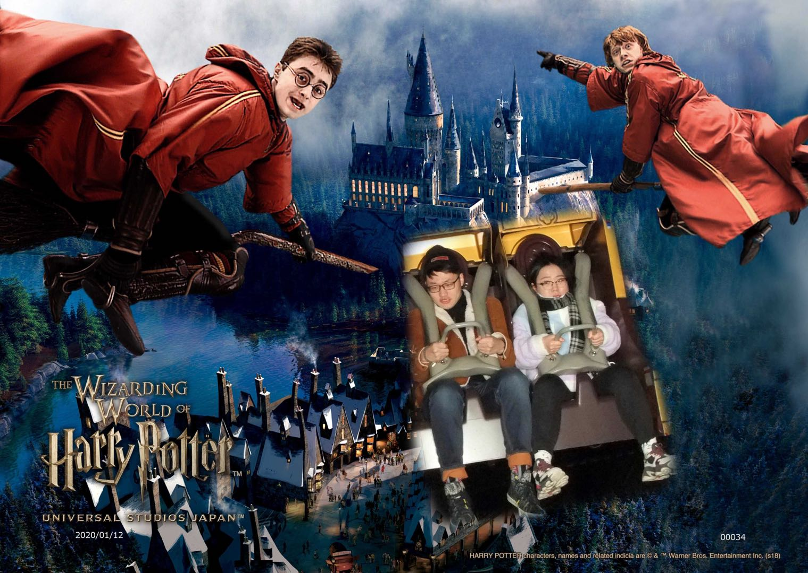

开始玩哈利波特了，这个会要求存包。接下来是四个人一个设施。真的太赞了！会模拟骑扫帚！魁地奇！三王争霸赛！对抗食死徒！还有超恐怖的摄魂怪！超逼真！属于那种好想好想二刷的游玩设施。玩出来看到我们的抓拍，真的是太沙雕了（我明明有在认真的管理表情）。作为沙雕体制的我们，自然是毫无疑问的买下来！

接下来去了奥利凡德的魔杖店，有一位演员扮演奥利凡德，会随机挑选一名观众，来表演harry选择魔杖的情节。我们这一组人选择了一个小男孩，似乎还是中国人。全程懵逼哈哈哈哈太逗了，最后懵懵的拿着魔杖走了出去。在园区里拍了很多照片，还看到了小天狼星的通缉令！顺着地图接下来玩了大白鲨，不得不说这是快速票用的最值的一个项目。完全没有感觉（好吧其实有一点）。但是相比起前面的几个就显得有点naive，随船的工作人员戏还是很多的。

大白鲨出来后我们去了水世界的表演。这个太酷了！在一个超拟真的场地里面近距离的观看了一场琼斯博士和劳拉的冒险秀！场地很大，开始前有三个热场的演员，穿的废土海盗风格（不得不说在冬天还是很冷的）。而且最赞的！会像海盗一样训练我们，比如一起做手势之类的，如果做错了会直接泼水（前排必备雨衣）。太酷了！第一排坐了两个小朋友，被泼了之后一脸懵逼。一个工作人员拉他们上去，让他们用水枪去喷泼他们的那个演员。两个小朋友穿着小黄人和蜘蛛侠的雨衣，摇摇摆摆的走上去，小小的手拿着大大的水枪，一脸无辜的喷水。之后又请了一位大叔上台，也是让他去喷，结果当然是毫无疑问的被戏耍了。（成年人的世界好卑微）。正式的表演开始了，虽然全程日文，但是剧情还是懂个七七八八，基本上就是劳拉找到了宝藏——坏人找到了劳拉——琼斯博士找到了坏人这种葫芦娃救爷爷的剧情。现场看表演，完全就是现场电影的感觉，而且是面前好几个摄影机同时观看。这边是坏人头子在逼问劳拉，那边是琼斯悄悄地潜入敌人内部，两只眼晴根本不够用。演员的表演也很卖力，有直接索降的，有高台被打死掉水的，有骑摩托艇玩杂技的，大冬天劳拉穿着短袖短裤跳水真的是太强了（还有蓝色的小内内）。场地的爆炸效果超逼真，各种爆炸，各种设施毁坏。怪不得一天只演三场。本来没打算玩这个，这个实属意料外的惊喜！

这时已经下午了，我们接下来去了浴火赤子心的场地。其实并没有怎么看懂，全是日文并没有字幕，不过最后的火灾场地模拟还是十分逼真的。有个小孩好像吓哭了（感觉环球影城还是得大一点才可以玩的很好呀）。路上路过了飞天翼龙，满天都是杀猪般的叫声，这个真的是敢看不敢玩。

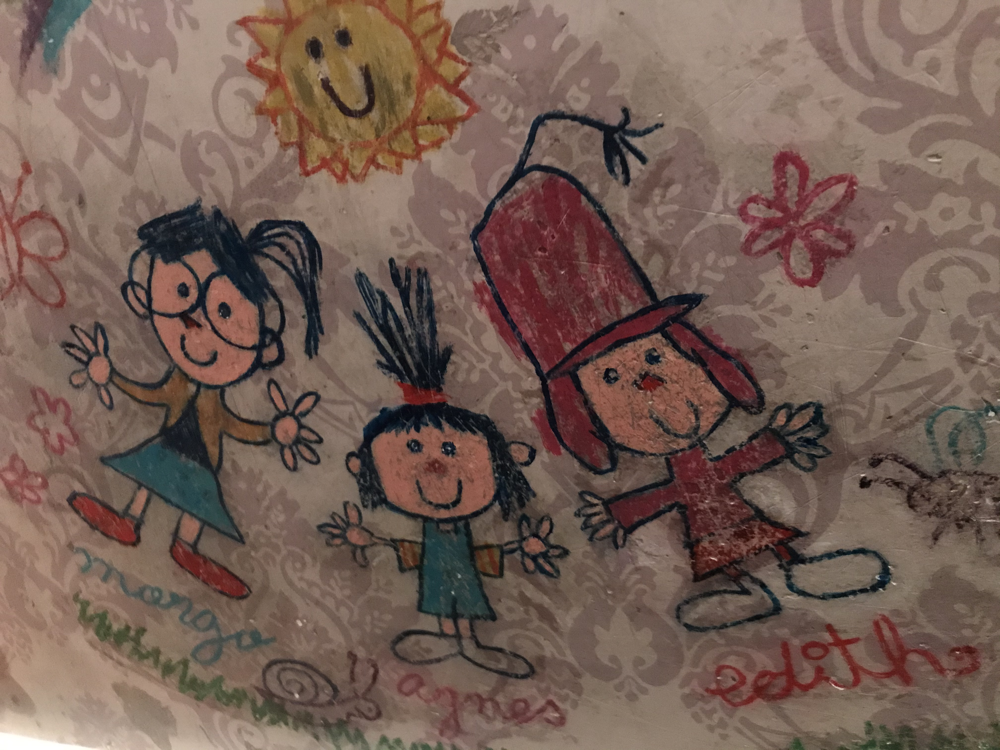

下午时间到了！我们前往了小黄人的场地，真的很萌。快速票基本上十分通畅的进入了，里面的陈设是Gru家的房子，还有一些小细节很赞，有Gru三个女儿的小画像。小黄人有特制的动画剧情，还是很酷的。但是这个时候我有点饿的腿软，不过总体来说还是很好玩。出来后我们去了Happiness Cafe用餐，这里也是小黄人风格的。我点了一份汉堡餐，徐徐点的是咖喱饭。不得不说比迪士尼好的太多了！好吃而且也不是特别贵。

最后我们去玩了侏罗纪公园，一个激流勇进的活动。徐徐全程紧张脸，不停的看船上贴的安全警告，一脸“什么在前面在哪里我要怎么办”的表情。最后的一下冲刺来得太突然，完全没有准备，十分刺激，我的前列腺表示很赞。出来后看照片也是十分的狰狞。

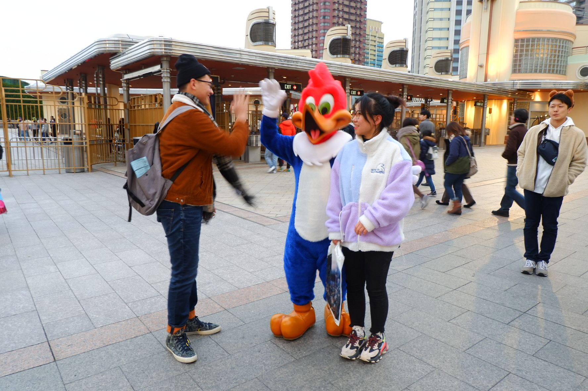

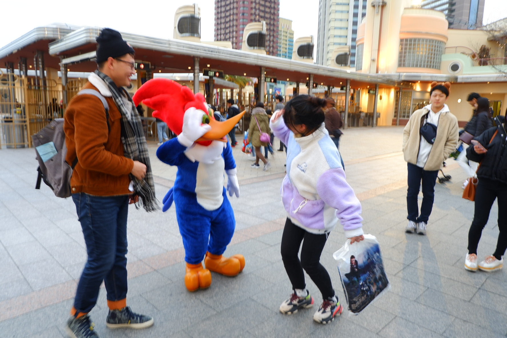

这时基本上也是下午五点钟了，游玩了9个项目，还是非常满意的。我们路过了一大堆等待看冰雪表演的游客，又逛了逛商店。即将出门的时候碰见了一只吉祥物，和他合影互动。最终不舍得离开了世界上最快乐的地方（当然还是摆拍了很多）。

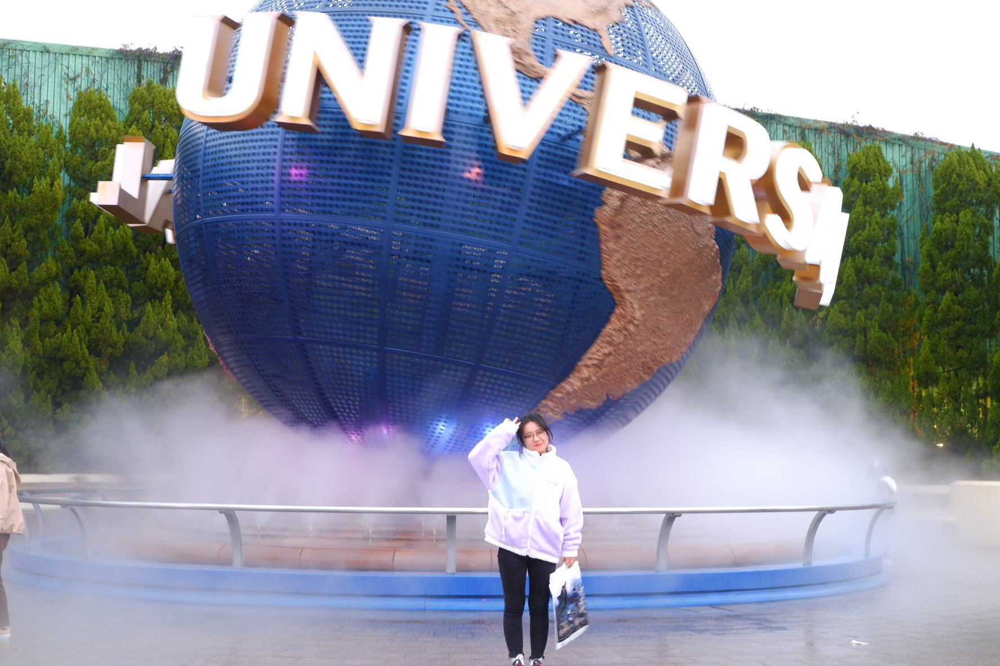

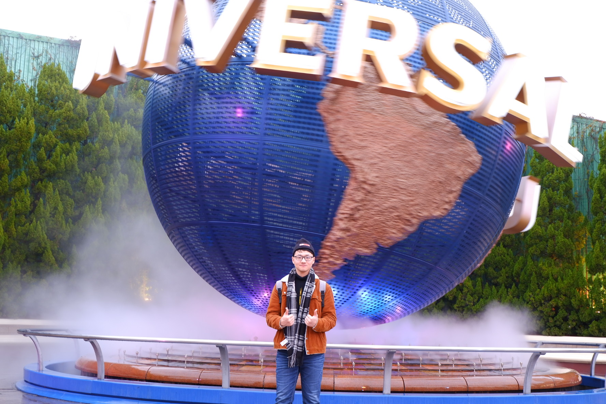

晚上前往了心斋桥吃和牛烧肉！坂前一本烧肉店，也是在大众点评上很有名。我们在等位的时候基本都是中国人。烧肉还是不错的，徐徐觉得有些油腻，我倒是觉得肥一点比较好吃（这就是胖的原因）。点了四份烧肉，就上了小小的两盘，吃起来还是挺饱的。烧肉配啤酒（虽然并不喜欢喝酒），赛高！

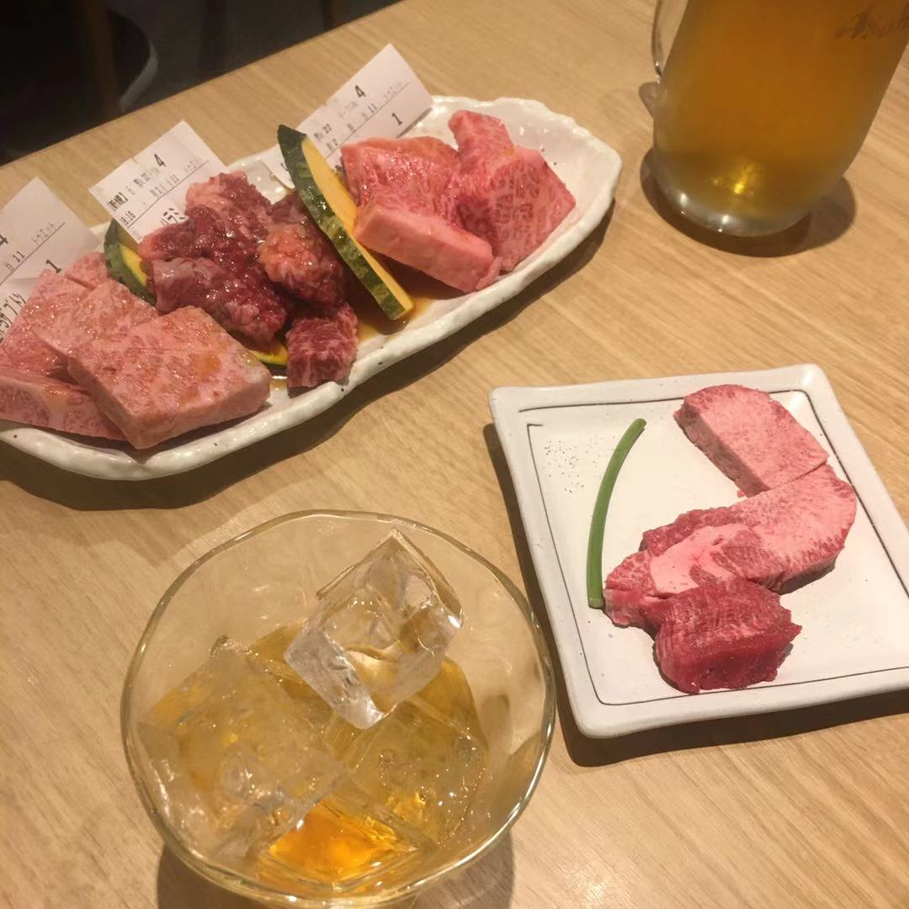

回酒店前去全家买水和零食，买了一个巨奇怪的薯片，梅子味的…口感十分的难以忘记…属于猎奇款

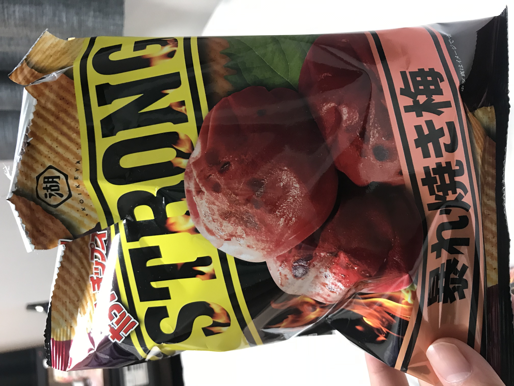

今天刘刘没有洗jio，差评。

