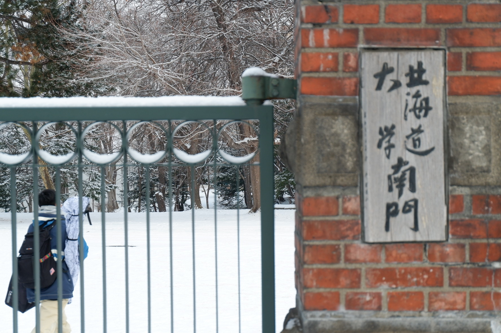
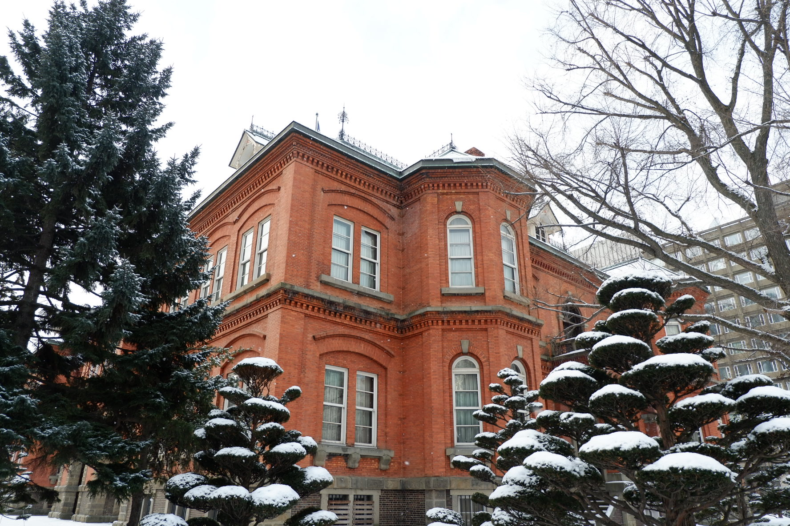
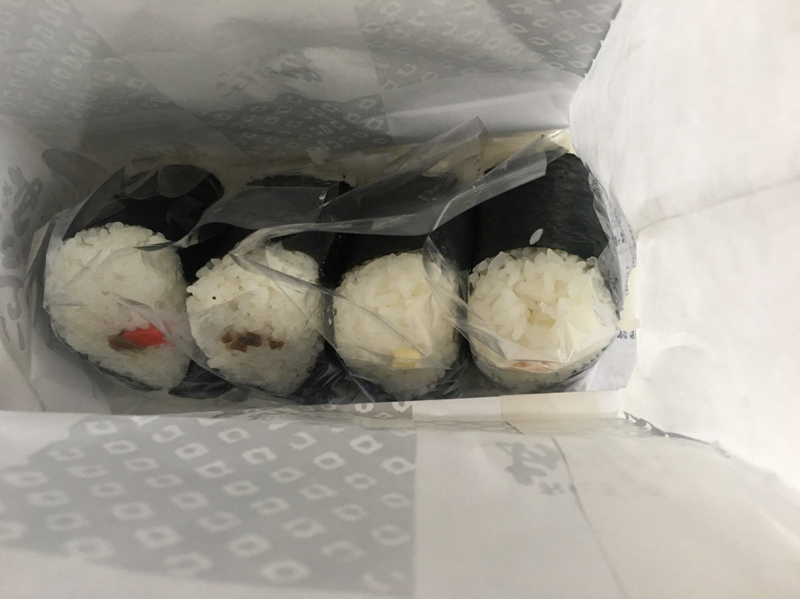
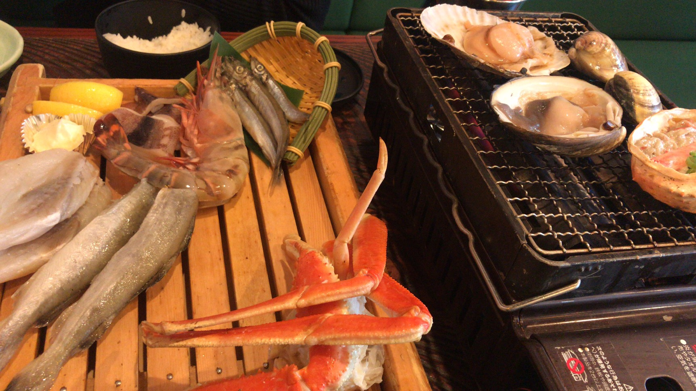
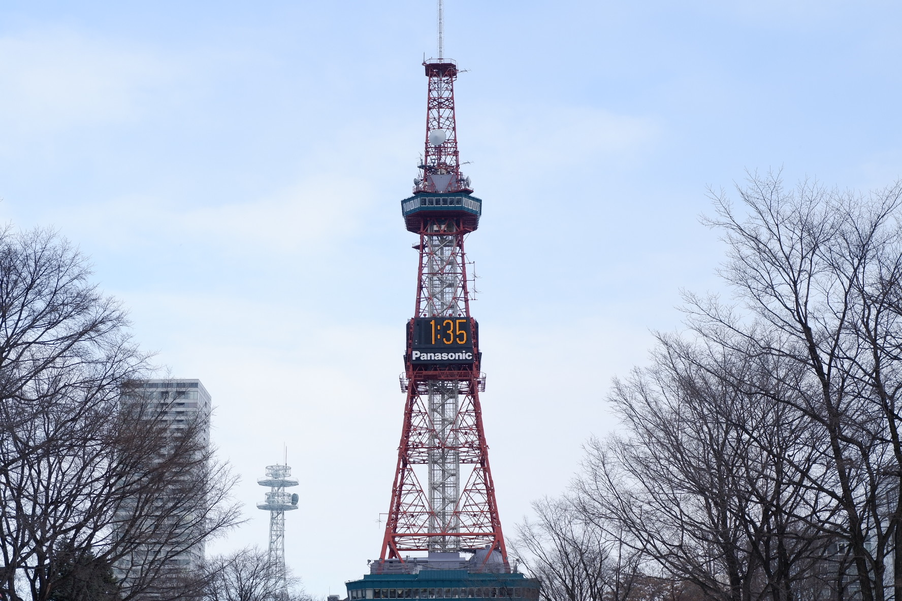
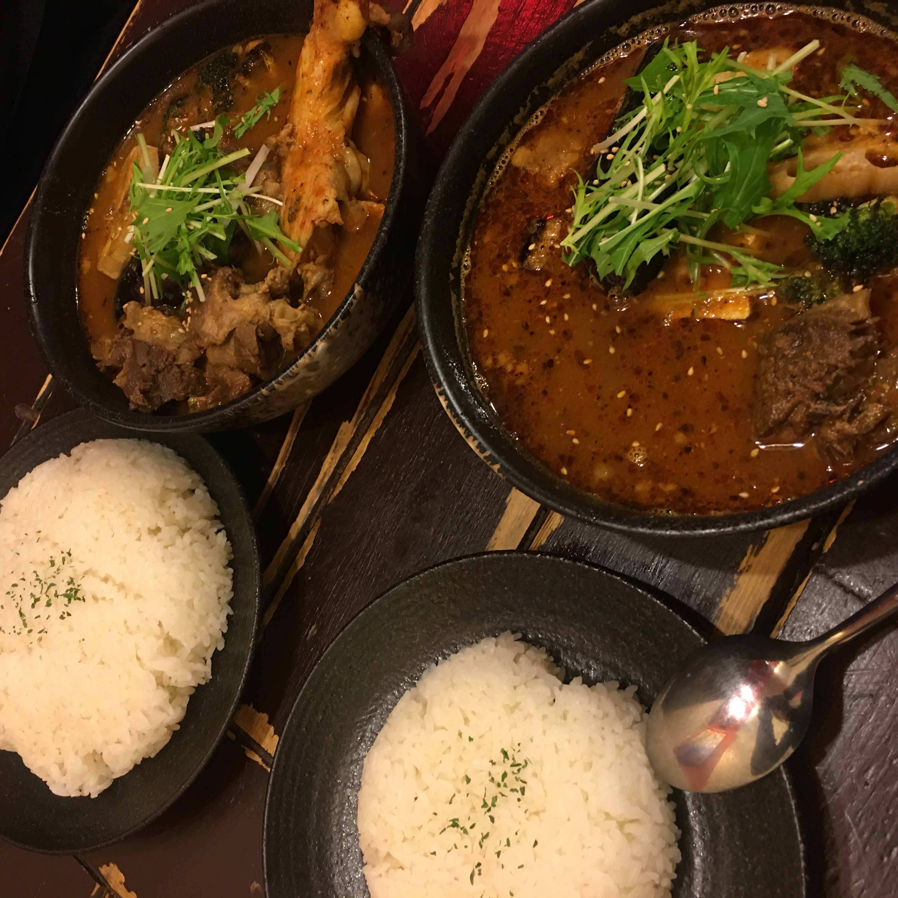
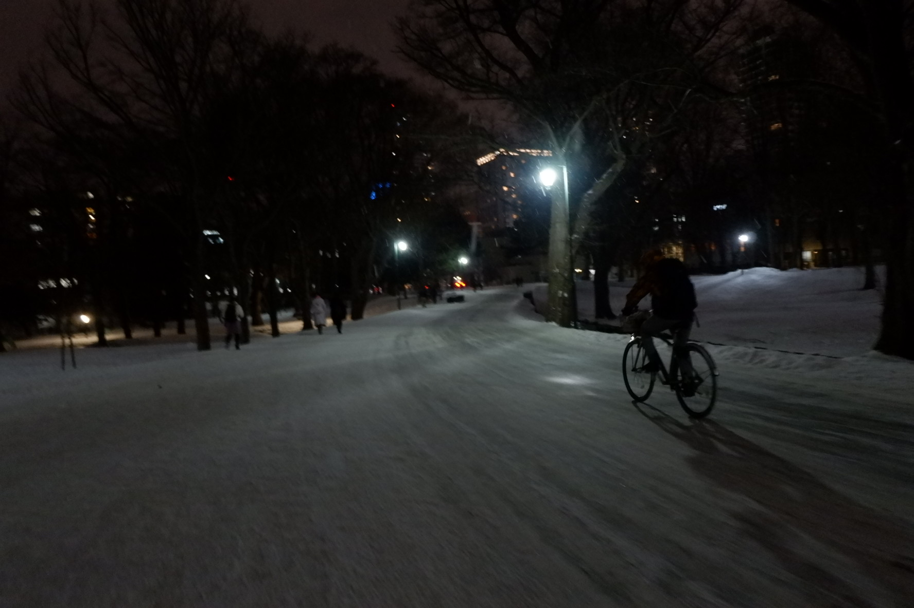

# 2020.1.15 周三

早起去买了饭团，私心其实是想在札幌走一走。早上果然又飘起了雪花。顺着昨天的路走下去，发现实际上JR站就在很近的地方。而且出人意料的大。

出了酒店后打算左转看看，结果发现这里是北海道大学的南门。还是有很多看上去是学生老师的人进入。大概看了看就离开了，路上路过了一家看起来很有感觉的小食堂。门口有一颗红色树叶的树，后院有一个灯笼，雪落下来后像第一教团的风暴兵。

路上有很多上班族，早上的风雪还是挺大的。札幌有一些街上的廊桥，可以在室内走过一段街区。确实能让脸回回温。绕了一段路走到了市政厅这里，这个楼真的是太好看了！有种欧式的感觉，红砖配上白色的雪，有种童话的感觉。虽然是早上8点，还是有很多中国游客在拍照片。本来想在一些奇特的角度拍拍照片，但是有一大堆上班族走了过来，只能作罢。

饭团在JR站里面，稍微有点难找。似乎吃的都是当地人，店员也不太会英语，但是个和蔼的老奶奶。点了四个饭团，一个芝士、一个生姜烧牛肉、一个芥末、一个猪肉。（感觉还是买多了）

回到酒店吃掉了三个饭团（真的好顶饱）。稍微休息了一下就出发去吃大庄水产（徐徐真的好爱睡觉）。大庄水产早上已经路过了，11点出去的时候已经没有雪了。但路上的积雪还是挺厚的。路过一个停车库的时候，有一个门卫小哥用小红棒在指挥，也会让行人先走，感觉还是挺好的。

大庄水产a little disappointed。服务不是很好，点了一些海鲜很多都烤焦了。不过虾确实是大，还有螃蟹也不错（不过我对海鲜没有什么感觉）。

吃完大庄水产前往了大通公园。似乎公园里在进行雪雕节的制作，不可以入内。有点小失望，不过也拍到了计时塔。札幌的天真的好干净，拍什么都很好看。

在7-11买了两瓶热茶（不得不说他们的热茶真的so 难喝），尝起来像一味药。我们在薄野走了走，打算去逛逛GU和优衣库（打脸时刻）。GU真的好便宜！我们逛了将近两个小时，买了六件衣服，总共花了300块（李佳琦式WoW）。当初我在优衣库一件牛仔外衣就花了300…这个也达到了免税的额度。GU的员工在我的护照上盖了个小票。这时我才知道好像出国才能用免税商品…sad，不可以穿新衣服了。

快乐shopping结束后，我都觉得有些累了，徐徐竟然元气满满的说可以走回去（女人真是神奇的生物）。路过昨天走过的市政府前方时碰见了电视台录节目，我们好奇地走过去还伸脖子看，突然意识到可能上电视了，真是神奇的体验。

把衣服放在房间后就出来了，今天晚上还是吃汤咖喱。在Hiri Hiri2吃，这一家店感觉人比较少。相比起昨天那一家没有放椰奶，但是鸡肉更软。也是非常好吃的！

吃完后我们前往北海道大学走走。这是天色已晚，雪也渐渐大了起来。北海道大学从外面看黑黑的，学校里面倒也还算明亮，配上雪景也别有一番风味。我们潜入了他们的图书馆和教学楼，撒了一泡充满知识的尿。又 穿过了n个复杂的教学楼才出来。一出来就看见了大学里的小超市，买了这里很有名的北海道大学饼干（就像小时候吃的奶片），还有冰淇淋。在大大的小雪中吃着冰淇淋，我们就是最憨憨的外国人。大学还是很美的，童话的感觉，拍了很多乌漆麻黑的照片，但是感觉还是很棒的。

睡前又买了麦当劳！没想到这里的麦当劳没有鸡翅，但是有很多汉堡的样子。虽然都看不懂，点了一份招牌的双吉，麦乐鸡和薯条。他们这里麦乐鸡标配似乎是烧烤酱。略有些失望，看来日本的麦当劳好像没有什么很特别的食物。

晚上回到家十分的疲惫，听说我很快的失去了知觉。

