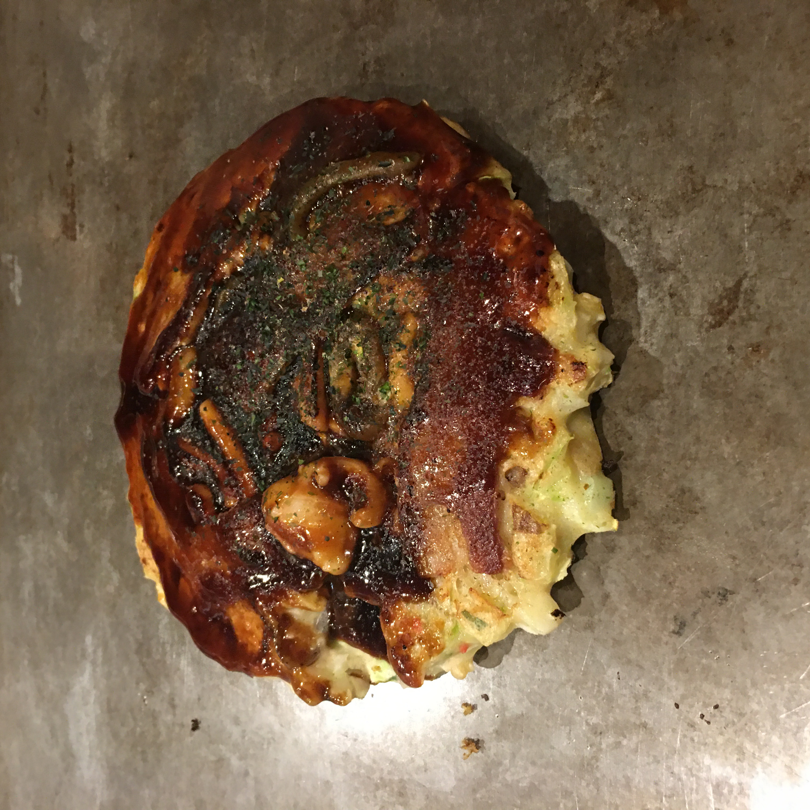

# 2020.1.13 周一

前面两天有点累了，今天是很养老的一天。早上9点才起床，进行了一会文学创作（其实是补前两天的游记）。徐徐在旁边写论文（so sad）。11点的时候才出门。

打算去吃蛋包饭，在道顿堀的北极星蛋包饭。似乎是一家本地人也会喜欢去的店。很古朴的装潢，店的中间还有一个小庭院，里面是榻榻米的风格。顾客都是盘腿坐着（对我来说太残酷了）。排队有很多，进去之前要先脱鞋，本来在担心会造成十分不好的社会影响，回来发现也还好。蛋包饭和炸牡蛎都还不错。

吃完蛋包饭后去逛了逛唐吉柯德，并没有发现有switch的踪迹。时间不太够去大阪城了，中途从地铁换了目的地，前往黑门市场。很有回民街的感觉，有很多海鲜的烧烤，一般般的关东煮，不甜的草莓，和超难喝的豆浆。嗯，确实是回民街的感觉。

去延羽之汤！太棒了这个地方！去的时候其实离预定的时间稍微晚了几分钟。一进大堂先要脱鞋存鞋，接下来去前台办理。虽然前台有多个窗口，也没有什么标志说先排队等窗口叫，但是当地人还是认真的排队，我们反而懵懵的插了队，被服务员提醒了😅。预定的包间在四楼，点了日本酒的入浴剂。我们乘坐电梯上了四楼，有专门的人员引导我们。首先是换上木屐，穿过走廊，到我们的房间。有一个小榻榻米，梳妆台。室外是露天的温泉，太酷了！明明室外很冷，但是赤身裸体的泡在温暖的泉水里。就好像冰淇淋蛋糕上的小熊，躺在融化的芝士上一样，语言显得十分的苍白。

泡了一会觉得有些热了，出来喝了喝水，冲了冲澡，时间就到了。so sad，快乐的时光总是短暂的。希望下次还可以来这里！

晚上去梅田吃大阪烧！来大阪当然要吃大阪烧！没有选择大众点评推荐最多的那一家，而是选了一家看起来很偏的小店（事实证明其实很偏）。百年老店，米其林一星！在电铁轨道的下面，一个小阁楼。对面着厨师有六个座位。很有感觉！可以说是在大阪吃到最好吃的食物！而且很平价！

吃完逛了梅田的商圈。真的是好 大 啊。感觉比上海的陆家嘴和南京路大多了。多个大的商场都在这里，友都八喜、Lucca、Hep Five。逛了逛衣服店，但是没有看到很好看的衣服。看了看switch，感觉也不是很便宜的样子，不过一定要去东京买！还有玩具的地方也好好啊！star wars的手办太赞了，隔着玻璃我都感觉到原力在呼唤我（的钱包）。

前往Hep Five的时候路过了一家周董开的奶茶店，在上海十分的火爆，这里却有点冷清。打卡的多是中国游客。Hep Five的员工真的十分卖力，十分十分的卖力。吸引顾客的叫卖，用尽了毕生的力气在叫卖，还有夸张的肢体动作，整个卖场的氛围突然昭和了起来。在Hep Five逛了一家中古店，我还是第一次看到卖旧衣服的店，真的是各式各样的旧衣服，有点看上去还是挺新的。不过我有点本能的反斥穿别人穿过的衣服……所以也并没有买什么。

回到酒店其实很累了，感觉今天走的很多路（其实并不）。泡了泡脚，算了算钱，感觉花了很多但是实际上还是省了！

明天就离开大阪前往札幌了。有点小小的不舍，没有去天守阁，也没有去新世界。感觉小巷里也有很多好吃的小店，大阪的人感觉很安静，城市也很干净。喜欢大阪！一定还会再来的！我胡汉三（划掉）会回来的！

放一张大阪的夜景（随手拍的），塞呦那啦！Osaka！

刘刘今天洗了两次jio，不臭了。请继续加油哦💪！

