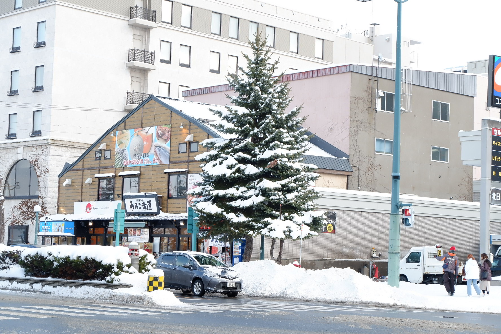

# 2020.1.16 周四

昨晚出人意料的睡的很早，想来是前几天确实太累了吧。感觉从出发前的那一晚上就没有睡的很好，有些择床也说不定。（嗯说明我就是不是很能睡）。今天也是早上9点才起床（睡了13个小时，札幌真是太好睡了）。

早上在罗森买了早餐，感觉他们这里的罗森好好吃！有一个照烧味的三明治太好吃了。回来的时候发现隔壁的情侣也是中国人。

11点出发到小樽去，徐徐的卡不见了。买了车票前往，买车票的时候全靠瞎猜，竟然买对了，我真是个带天才。

车上基本都是中国人，也有到小樽上学的学生。看到一个姑娘在门旁边紧张的补作业，感觉全世界的学生都是一样。想起来那天去神户机场的时候也看到一个朋友在座位上写什么东西，想看可能也是个学生吧。

火车会有一段沿海线。非常好看！没有见过这样的风景，上面是雪，下面是海。不同于那种海滩阳光的大海，这里的海更有些深蓝，火车开过去的时候有雪花飘过，有种身处龙石岛的感觉。看到大海的时候游客都起立了，有一个胖子提着行李箱，一边拍视频一边说太牛皮了。旁边站着一个看书的学生，看了眼没见过世面的中国人又默默的看书。有个泡面头的小哥本来想下车走到门边，结果被拍照的游客挤满了，也很无奈的悄悄嘴角下垂。

小樽真的好冷，下车的时候雪也很大，冰冷的雪在脸上胡乱的拍。我们先去了三角市场吃海鲜丼饭，三角市场很近，像临时搭起来的避难篷。里面基本全是卖海鲜丼的。本来打算吃的淹波食堂排队了至少十几个人，作罢。在旁边找了一家鲜鱼食堂吃。徐徐点了海鲜丼饭，我点了烤鱼定食（虽然不知道是什么鱼）。海鲜丼饭看起来很丰富，有虾、生鱼片、鱼籽、海胆。我尝了尝，生的食物的确都是我不能理解的（茹毛饮血）。烤鱼定食还可以，至少米饭很大份。

吃完饭买了草莓，比大阪的要便宜一点，也要更甜。出三角市场之后还在下雪，雪稍微的小了一点。太阳也渐渐出来了。我们顺着路一直向大海的方向走。小樽真好看，异域风情的建筑和雪花，房屋上还有冰凌，怎么拍照都很好看。想起只有我很小的时候，在工贸市场才看见有冰凌玩。小樽运河旁的博物馆门口有一个消防犬的雕像，穿着可爱的毛衣。虽然看不懂下面写的字，但想来也是立下过丰功伟绩的狗狗吧。

小樽运河旁人还是挺多的，但也属于可以接受的范围内。拍了一些照片，碰到了一组香港游客，让我们帮他们拍照（事情是真的多…）。顺着运河一路向南走，买了北海道的冰淇淋（蜜雪冰城你还是可以的）。走进了他们这里的商业街北一哨子，这里有很多卖玻璃的店，还有八音盒。一部《情书》真的给小樽拔创许多。吃了一份北海道的炸鸡，还不错，只是路上没有垃圾桶。寒风中提个塑料碗蜷缩着前行，给个快板就能张嘴要饭。

回JR的路是上坡路，徐徐果然预料之内的表示惊奇“我们来的时候不是下坡呀”（呵呵）。看到了这里的肯德基，感觉很好吃的样子（虽然也是普通的炸鸡）。在小樽的商场撒了一泡寒冷的尿液，时间已是下午三点。我们坐车返回了札幌。

四点左右到了札幌JR站，我们打算去薄野附近找点吃的。走着走着到了宝龙拉面，这里也是在名单上的一家。店面不大，有三四个老爷爷在做面，墙上有很多来吃过名人的照片和签名。看起来似乎还是米其林一星，算下来是我们在日本吃过的第二家米其林餐厅。餐厅到现在似乎已经70多年了。拉面很棒，我点了辛拉面，有股韩式辣酱的味道，面条有点像方便面的样子，不过口感韩式很不错的。点了一个煎饺，感觉一般般，大葱猪肉馅的，皮不是很脆。

吃完拉面一身暖和，我们准备前往生蚝的所在。二条市场这个时候已经很暗了，五坪是真的难找，我们在店门口徘徊了许久终于确定了这个就是五坪生蚝（最后发现好像还是分店）。店里就只有一个小哥，还有两个中国游客。这里是必须一人一份酒水的。我们落座后点了梅子酒，6份生蚝，两个烤生蚝，三个酒蒸生蚝，三个醋烧大蒜生蚝。后来又加了芝士海苔生蚝和鸡蛋糕生蚝。虽然我对生蚝感觉一般，但是后面三种做法真的让人惊艳！吃到后面来了一位日本人，看起来他们很轻车熟路的样子，和老板有说有笑的。

回酒店的时候买了甜甜圈，是世界上共同的味道。晚上泡了脚，但是这里的浴缸太小了，我们就站着泡了脚。可能因为吃了生的肚子有些不舒服，在札幌的最后一夜，就在浓烈的屁味中度过。

