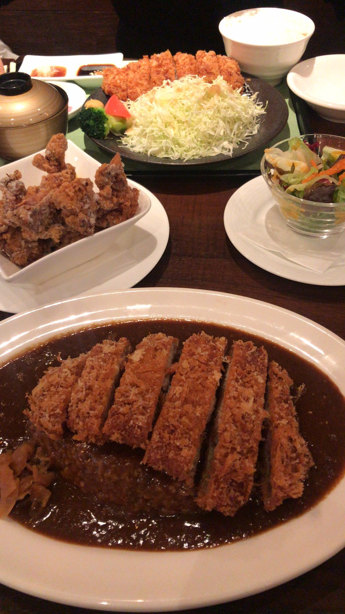

# 2020.1.17 周五

今天基本一天都在路上。

早上本来想再早点出门去看看北海道大学，但是被床紧紧的禁锢了，没能挣脱。11点出门前往了新千岁机场。新千岁机场是挺大的，里面有很多商场和饭店，（而且竟然还有一个电视活动？）。我们吃了炸猪排和咖喱猪排饭，吃的时候还是蛮不错的，但是吃完了感觉有点腻。

登机的时候有很多外国人，还有一个穿的花里胡哨的中国朋友，西装耳钉（真的在北海道不冷吗）。飞机起飞后窗外的风景很好看！我们在云上很高的地方，看起来就像一块块奶油。

到达东京的时候其实已经挺累了，而且之前看到成田机场离市区是相当的远，大概类似于上海的机场建在苏州一样的感觉。并且看到似乎快速的列车是有时间限制的，因此下飞机后还是十分焦急的前往JR站。不得不说他们的机场十分不人性化……，从T3到T2走了将近一公里，没有电梯、没有摆渡车，甚至都不是楼宇内部，而是一个专供人走的通道。

东京的地铁真的真的真的好复杂。买票用尽了我毕生的智慧。足足用了3个小时我们才找到酒店。到酒店的时候已经是非常的疲倦了。我们出门瞎走了走，找了一家很local的炸串店结束了晚餐。

回酒店后没有什么精力洗澡了，很快就睡去了。

