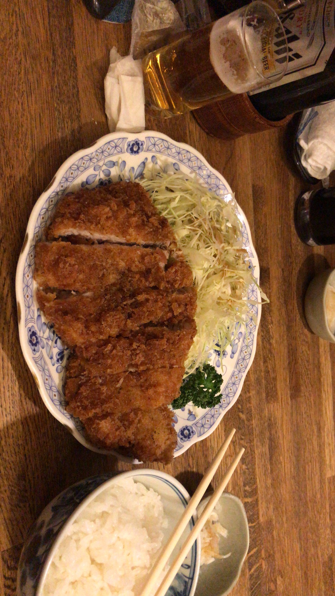

# 2020.1.18 周六

真正的第一天游玩东京。今天下雨了，早上10点多我们从酒店出发。这个酒店的前台在2楼，一楼是停车场和垃圾桶（amazing的设定）。因为下雨还是蛮冷的，我们不得不回酒店又加了衣服。

早上出发去浅草寺。我们居住的地方是浅草区，据说是东京的后花园。从酒店一出来像东北方就可以看见晴空塔，在雨中晴空塔有一番别样的风景。从酒店到浅草寺并不远（其实还是有一点远），过桥后很明显就看到了日式寺庙风格的建筑。即使不是学建筑的我，也觉得这些建筑赏心悦目，想来那些学建筑的朋友应该能看到更多吧。

到达雷门的时候雨势正大，雷门还是相当气魄，只不过还未到浅草寺。当时还并未知道，直到离开浅草寺的时候我们走的是巽门，才明白原来浅草寺外圈是一层八卦。

我们首先去吃饭，找到了一家叫做浅草今半的寿喜烧店（有可能是来日本最贵的一顿）。店门是关闭的，我们打量了许久才进入。店内人不多，很古朴的样子。我们点了两份肉，一个炖鱼，两杯梅酒。寿喜烧是一个很有意思的食物，有铁板在下面烧，同时在铁板中浇上一种甜酱，这样烧出来的肉带有一股甜味，但又不似那种普通的糖甜。一开始有个日本的小姐姐在帮我们下菜，基本是下两片肉，接下来将蔬菜摆满盘子的剩余部分：金针菇、葱、粉丝、豆腐、生菜。看了一次大概就明白了，快烧干的时候加酱、酱太稠的时候加水。

很美味的一餐，最后花了一万左右的日元，折合人民币就是600多块。非常贵，但也没超乎预期，在上海吃可能会更贵吧。

吃完饭身上也暖和了起来，我们很快就到了浅草寺。想来春天的晴日来会更有感觉吧。说到这里，来的路上看见了一对中国游客，穿的一身和服，只可惜今天又下雨又冷，倒也可怜他们。我们在浅草寺求了签，求了四次都是上签，还都是同一符。我对神佛之类并无信仰，但也无抵触，不过这也是值得开心的事情。在浅草寺求了一些符，带回来做伴手礼。

从浅草出来后我们去了一家叫welcia的药妆店，徐徐要买一点药妆。我在楼上的店稍微看了看，也在思忖回国要带点什么。清酒和香烟都不错，但是看起来不是很好带的样子，遂作罢。

从浅草出来后我们前往了银座，这里是和巴黎香榭丽舍大道，纽约第五大道齐名的世界三大繁华中心。银座应当是从南到北的八个大街区，前几日在日本见 过的店在这里都有。我们在其中一家店里停了许久，徐徐要买几个化妆品。我在一边等候，这里的中国人非常多……我在休息的时候，旁边坐了一家北京人。应该是爷爷奶奶带着孩子坐在那里，父母去血拼了。导购的中文讲的很好，在各个店铺中充当翻译。

从店里出来后我们打算去bic camera看看switch，进行了一些十分复杂的计算后发现似乎并没有比友都八喜便宜，也作罢。

接下来在寻找一家lumine底下的化妆品店，着实找了许久。在等待的时候我本打算晚上去秋叶原，但似乎秋叶原的店在晚上8点就会关门。遂打算明天再去。从银座离开后我们回到了浅草寺附近，找到了一家十分local的炸猪排店。基本都是日本人，猪排很好吃，但也没到令人惊艳的好吃，是十分舒服的家常菜。

晚上回到酒店异常的疲惫，还有许多东西并没有买。明日又是一天的shopping day。

