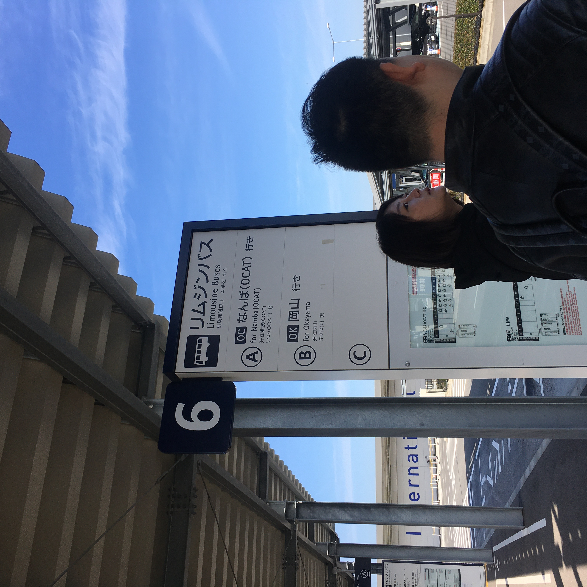
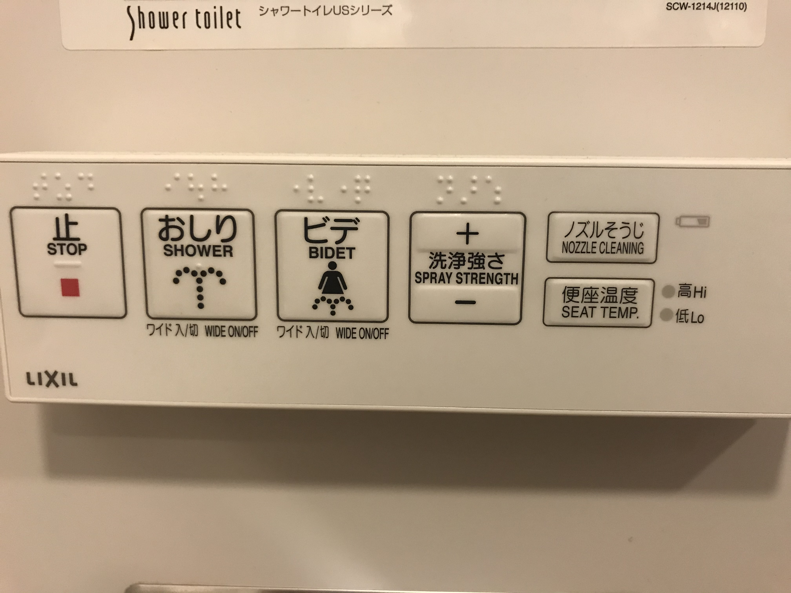
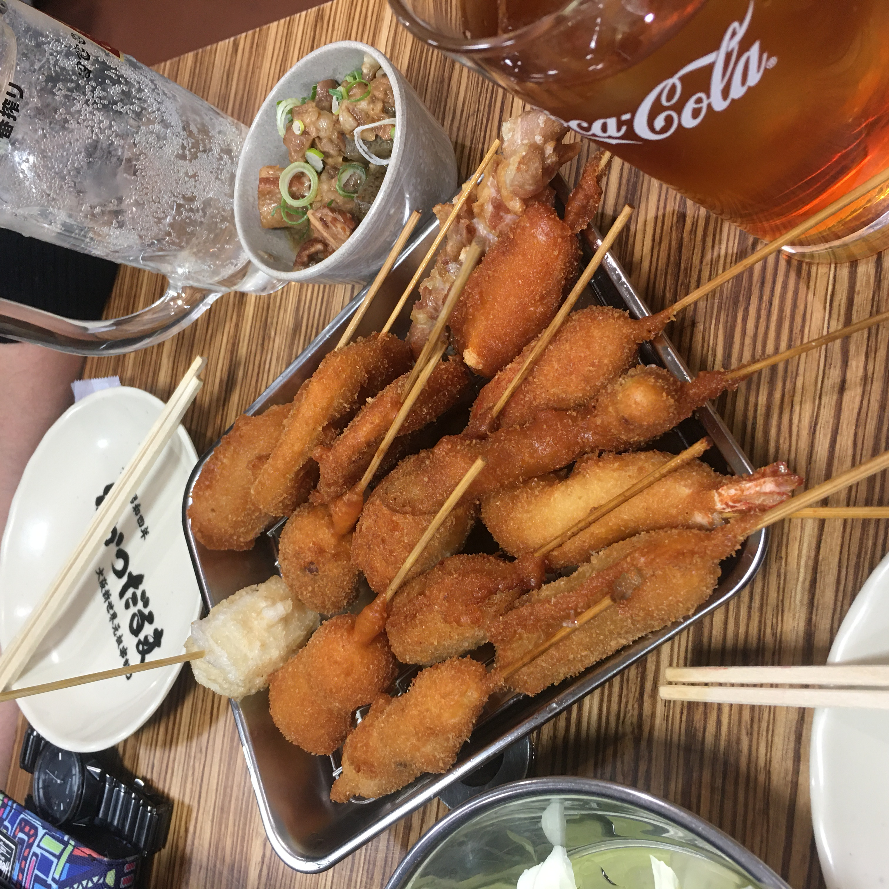
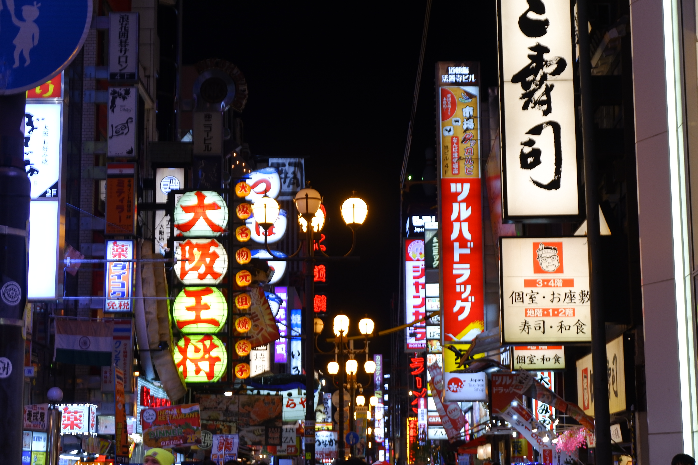
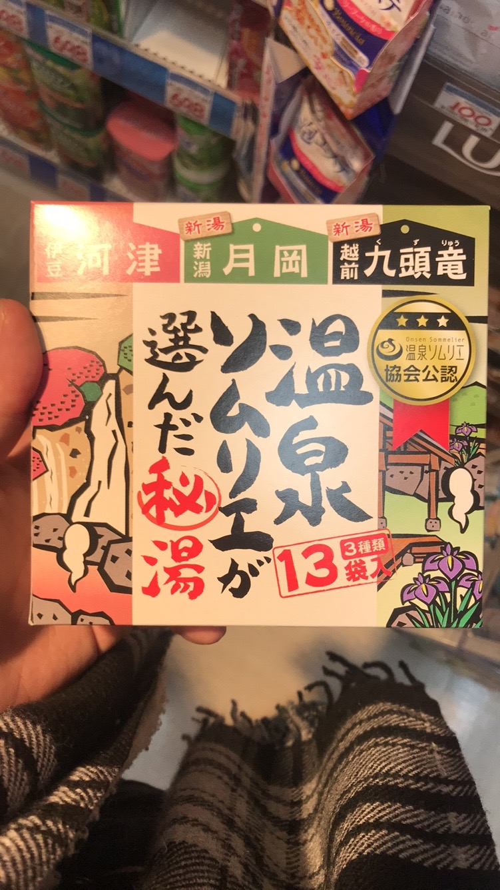

# 2020.1.11 周六

今天出发到日本！早上5点从酒店出发，昨晚睡的不是很好，有两个小孩拼命的喊叫…听了两段郭德纲才睡着。坐酒店的大巴到机场，碰见了两个带孩子回家的北京夫妇，在巴士上隔空对话，十分硬气。

（第一次）过了海关，（去香港那一次可能也过了但是忘了）。在浦东海关里的日上免税店见识到了女人的可怕…久违了两三瓶化妆品等一个小时。恐怖如斯恐怖如斯。

坐飞机很快到了大阪关西机场，由于日本时间早一个小时，事实上只飞了一个半小时就到了 关西机场好强！竟然全部是填海造出来的一块。关西机场的风格很朴素，感觉像一个工厂（想必这就是传说中的包豪斯风格）。落地后有些许的冷，不知道是因为心理作用还是什么，感觉天好蓝！可能就是外出游玩地方的天一定很蓝定理。

过海关的时候摘眼镜，按手印。日本的海关小姐姐好害羞，竟然比我还害羞。总之很曲折的沟通后过了海关。拿行李的地方有一位大叔专门负责把一些行李拿下卷带，感觉还是非常不错的一项服务。

并没有按照设想的那样坐南海电铁到市区，一出机场看到了春秋航空的服务台，感觉似乎像被骗了一样买了两张前往市区的巴士票。在6号站台上车，但是私以为巴士或许更好！时间价钱差不多的情况下可以看看沿途大阪的风景。

在巴士站台有位大叔会将行李箱收集起来，每个人发一张对应的小卡片。这样乘客可以直接上车，也不用抢着去放行李。下车后直接用票去换行李就好了。感觉日本在这一方面还是蛮贴心的。

路上风景很好！虽然是普通的街边小房子，但是有一种身处在日记里的感觉。旁边建筑的颜色都很素，灰色的混凝土更多，有一种发白的颜色。配上天空的很充满氧气的蓝色，感觉我就是木村拓哉！（其实并不）

一个小时就到了难波。这里差不多是上海的南京东路一带。下车后有些许的懵。如果说在机场还没有什么身处异国他乡感觉的话，到这里就一定充满到溢出了。小店、指示牌全是日文。刹那间仿佛处在人生和宇宙的十字路口。提着箱子，试图找到接下来怎么走的同时，感觉徐徐爆发的时刻在慢慢的逼近。

但是很快就又活过来了！通过上了个大阪厕所和喝了一瓶白桃水（女人的快乐真是简单而复杂）。找到了前往心斋桥Red Rock的路！走的时间感觉比较曲折，但是后来发现路还是比较好走的，大阪，至少我们活动这一区域的路都十分的笔直，建筑也是一块一块的，和西安的各坊感觉很像。

总而言之到了Red Rock，这里是一家和牛丼饭，在大众点评上很火（解释了为什么来的中国人这么多）。在门口的点餐机上面点餐，排队等待进入用餐。事实上虽然外面排队的人很多，但是进入餐厅的人数是有限制的，甚至有些座位还是没有人的。这样一来在餐厅里用餐的人体验就十分友好。感觉日本在人的体验这一部分确实还是满在意的。和牛丼饭有些没有达到预期，可能猜想中觉得很棒，但实际上是一家还可以的牛肉丼饭店，肉有点带生，口感的确和国内的牛肉不同，弹弹的感jio，酱料很好吃！我可以配着酱料再吃一碗米饭！

前往遥远的酒店（其实也米有很远，拖着行李感觉很远），日本都是右侧开车的，所以行人应当是靠左行，一开始确实有点不太习惯，路上碰见了几个十分杀马特的日本朋友，留着诺克萨斯的发型，也不知道是不是平常也敢这样上班，咱也不敢问。酒店还是很不错的！外面的装潢也很好看，前台的服务人员声音很小，很有礼貌（日本人好像都这样）。不过房间是真的小，打开行李箱需要一定的技巧。麻雀虽小五脏俱全，有冰箱、茶具、空调、加湿器、鞋刷子、浴缸……听徐徐说给的护发素什么的也是非常不错的牌子。终于见到了可以冲屁屁和加热的马桶盖！

休息了大概一小时，五点钟又出发啦！这次前往心斋桥和道顿堀，本来是打算先去吃拉面，然后吃一点炸串作为饭后小食。感觉他们这里的炸串还是挺贵的，一串基本上也要十几块，可能日本的朋友并没有把炸串当作正餐吃的那种食物。拉面是想去吃钝屋拉面，炸串要去远祖串炸。后者据说要排很久的队。我们坐地铁前往了心斋桥，不得不说大阪的地铁真复杂……地铁上看见了一个看书的老爷爷，感觉还是很不错的。

出人意料的发现元祖串炸不用排队！立刻去吃！点了16串的套餐，座位旁边有一条小电缆送过来食物。炸串很好吃！特别是对于我这个炸物爱好者！喝了一杯柠檬酒，感觉人生已经达到了高潮。由于吃的还是挺饱的，拉面就没有再去吃。路上碰见了章鱼烧的店，点了一份。真的好烫嘴，里面滑滑的，虽然我更喜欢有嚼劲的口感。

逛了很多的药妆店，这里基本走两步一个药妆店，里面的服务员都是东北口音……最后在唐吉柯德买了一包入浴剂，回去在酒店泡澡！晚上顺着小路回到了酒店，路过了一个疑似风俗街的地方（此处存疑），十分亦可赛艇。晚上8点钟，街上人就不多了，但是路边的小店里还是有不少人在用餐喝酒，深夜食堂即视感。

回到酒店后在浴缸里泡了澡！太舒服了，跑了一会就觉得好热，大脑完全放空，完全就是没有感觉的弱智人。酒店的电视可以直接看youtube，本地的电视台有很多都是橄榄球（没想到日本人也喜欢玩这个），有一个日剧但是看不懂。看了一会电视就打算睡觉了，明天要早起去环球影城。本以为会很快睡着，结果可能因为太兴奋翻来覆去了好一会。

总之，Osaka さいこう！

