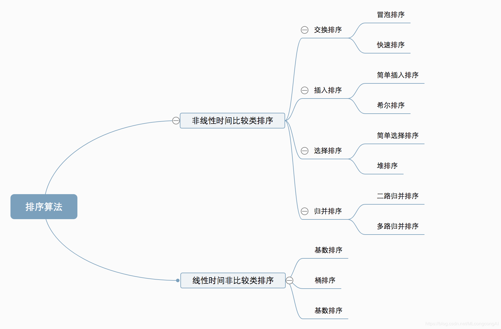
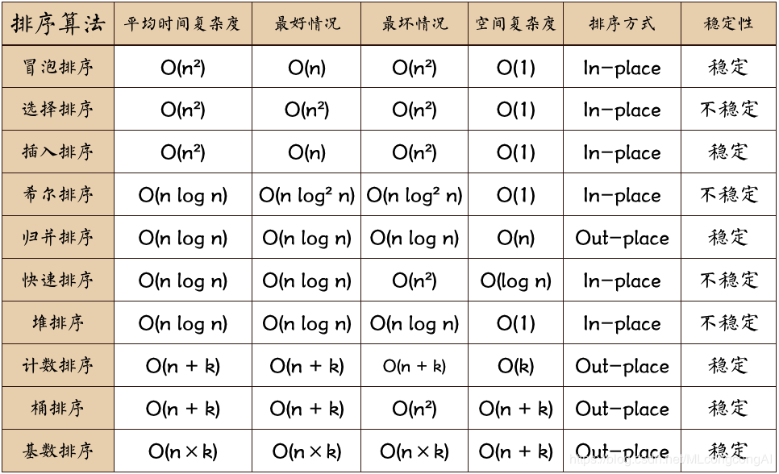

# 排序算法

### 分类

* 非线性时间比较类排序：通过比较来决定元素间的相对次序，由于其时间复杂度不能突破O\(nlogn\)，因此称为非线性时间比较类排序。
* 线性时间非比较类排序：不通过比较来决定元素间的相对次序，它可以突破基于比较排序的时间下界，以线性时间运行，因此称为线性时间非比较类排序。

比较与非比较

* 比较：快速排序、归并排序、堆排序、冒泡排序

  在排序的最终结果里，元素之间的次序依赖于它们之间的比较。每个数都必须和其他数进行比较，才能确定自己的位置。

* 非比较：计数排序、基数排序、桶排序

  非比较排序是通过确定每个元素之前，应该有多少个元素来排序。针对数组arr，计算arr之前有多少个元素，则唯一确定了arr在排序后数组中的位置。

### 算法复杂度

### 冒泡排序

**冒泡排序**是一种简单的排序算法。它重复地走访过要排序的数列，**一次比较两个元素**，如果它们的顺序错误就把它们交换过来。走访数列的工作是重复地进行直到没有再需要交换，也就是说该数列已经排序完成。这个算法的名字由来是因为越小的元素会经由交换慢慢**“浮”**到数列的顶端。

### 快速排序

**快速排序**的基本思想：通过一趟排序将待排记录分隔成独立的两部分，其中一部分记录的关键字均比另一部分的关键字小，则可分别对这两部分记录继续进行排序，以达到整个序列有序。

### 选择排序

首先在未排序序列中找到最小（大）元素，存放到排序序列的起始位置，然后，再从剩余未排序元素中继续寻找最小（大）元素，然后放到已排序序列的末尾。以此类推，直到所有元素均排序完毕。

### 堆排序

**堆排序**（Heapsort）是指利用**堆**这种数据结构所设计的一种排序算法。堆积是一个近似完全二叉树的结构，并同时满足堆积的性质：即子结点的键值或索引总是小于（或者大于）它的父节点。

### 插入排序

它的工作原理是通过构建有序序列，对于未排序数据，在已排序序列中从后向前扫描，找到相应位置并插入。插入排序在实现上，通常采用in-place排序（即只需用到O\(1\)的额外空间的排序），因而在从后向前扫描过程中，需要反复把已排序元素逐步向后挪位，为最新元素提供插入空间。

### 希尔排序

希尔排序是把记录按下表的一定增量分组，对每组使用直接插入排序算法排序；随着增量逐渐减少，每组包含的关键词越来越多，当增量减至1时，整个文件恰被分成一组，算法便终止。

### 归并排序

归并排序是建立在归并操作上的一种有效的排序算法。该算法是采用分治法（Divide and Conquer）的一个非常典型的应用。将已有序的子序列合并，得到完全有序的序列；即先使每个子序列有序，再使子序列段间有序。若将两个有序表合并成一个有序表，称为2-路归并。

和选择排序一样，归并排序的性能不受输入数据的影响，但表现比选择排序好的多，因为始终都是**O\(n·log n\)**的时间复杂度\(稳定\)。

