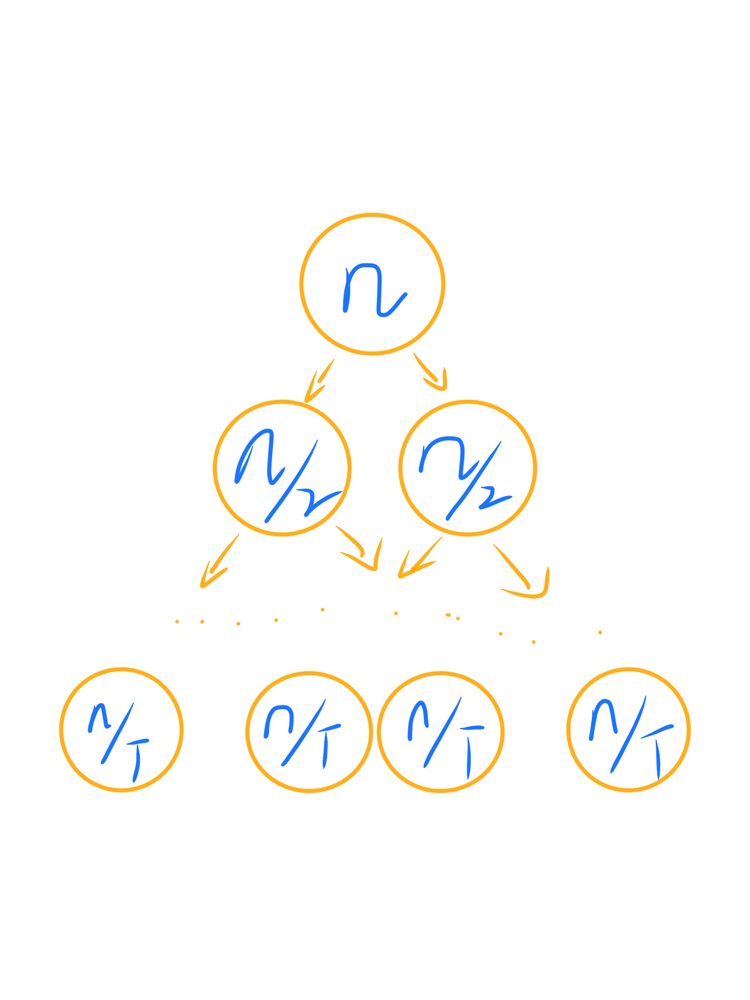
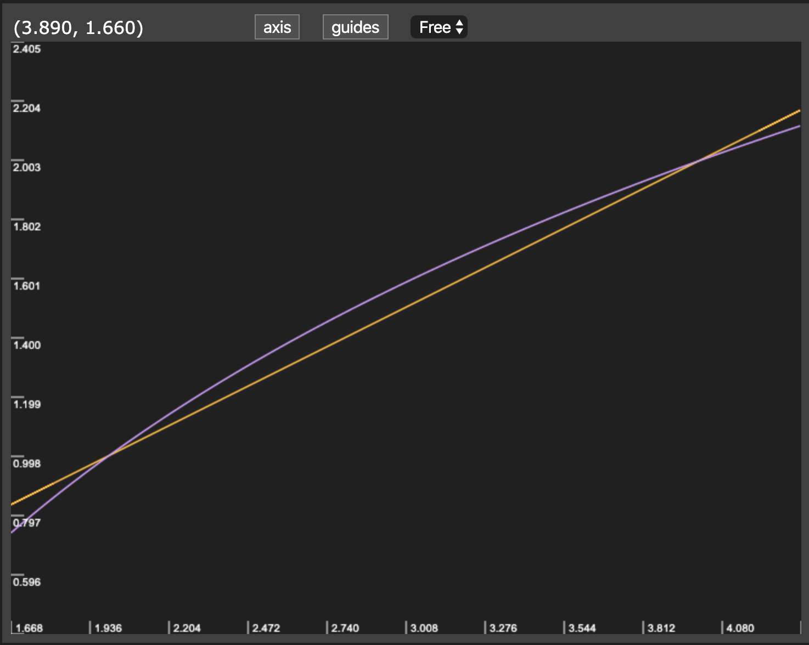

# 归并排序

首先来说，归并排序是一种递归的排序。它的优点在于时间复杂度在`NlogN`，而缺点在于其所需的额外空间与`N`成正比。

### 关于时间复杂度

曾经十分困扰我的一点是，为什么归并排序的时间复杂度在NlogN级别，明明对所有的数都进行了计算。这里要首先说明一下。对于一种归并的算法，我们可以画出一个对应的递归树：



对于每一层来说，总体进行计算的次数还是N，由于采用二分的方式进行，可以得到树的深度在logN+1。这样就可以得到总的时间在`N*(logN+1)`，由于复杂度我们求的是近似，因此最终的复杂度在`NlogN`。在引申一点说，比方说我们有两个串行的循环

```text
for(;;){}
for(;;){}
```

这个算法的复杂度依旧是`O(N)`的复杂度，如果要计算指令的运行次数，那么就是`2N`，这个取高阶无穷小就是`N`。再我们理解递归发生的压栈的问题时也可以这样想，对于N大小的数组的确发生了两次N/2的计算，但这两次是“串行”的。

同样值得说明的一点，为什么二分算指令的次数要按log算，我们可以去看这两个函数的图像，发现其实在小数据量时差异不算大，但是当讨论到时间复杂度时一定是在相当大的数据量前面进行讨论，因此在宏观上要用树的方式考虑，而不是简单的N/2。



### 思路

无论采用何种方式的归并排序，其过程大致是相似的。将数组分割为两个小的数组，排序后进行合并。因此合并是不可避免的过程，这个阶段对应的是`Merge`方法：

```text
Merge(int &a[],int low,int,mid,int high){
    res[]=a[];//res[]由上层传入
    int i=low,j=mid+1;
    for(int k=0;k<a.size();++k){
        if(i>mid)    a[k]=res[j++];
        else if(j>high)    a[k]=res[i++];
        else if(less(res[i],res[j])    a[k]=res[i++];
        else    a[k]=res[j++];
    }
}
```

那么可以看到`O(N)`的复杂度是从哪里来的了。在实际使用中，我们有两个思路去进行归并，一种是自上而下的方法，在实现上是明显的递归，我们通常采用这种思路。

```text
MergeSort(int a[],int low,int high){
    if(low>=high)    return;
    mid=low+(high-low)/2;
    MergeSort(a,low,mid);
    MergeSort(a,mid+1,high);
    Merge(a,low,mid,high);
}
```

另外一种是自下而上的思路，即手动的去找每一个小的区间。这样在实现上通常是迭代的。

```text
MergeSort(int a[],int n){
    res=new a[N];
    for(int sz=1;sz<n;sz*=2)
        for(int low=0;low<N-sz;low+=sz*2)
            Merge(a,low,low+sz-1,min(low+sz*2-1,n-1));
}
```

当数组的大小为2的幂时，两种方式的比较次数和数组访问顺序恰好相同，在其他情况下访问的顺序会有所不同。自下而上比较适合于链表这类的数据结构，其不需要反复的去界定二分的范围。

### 优化

我们可以给出一个命题

> 对于长度为N的数组，归并排序访问数组的次数最多为`6NlogN`次  
> 其中2N用于复制、2N用于将结果复制回去，而比较次数最多为2N。减少复杂度的根本是减少访问和比较的次数，我们可以通过几种方式实现。
>
> #### 对小规模数组使用插入排序
>
> 这样我们再回头去看log和x/2的函数，就会发现实际上在小数据量时，归并的速度并没有普通方法快速。因此在数组已经归并的相对小的时候，采用一种普通排序去处理它，比如说插入排序（或选择排序）。

事实上插入排序会更优，当我们分析这两种算法时就发现，即使都是平方级别的算法，插入排序不会移动比当前值小的元素，而选择排序会对每一个没处理的元素都进行比较。因此插入排序要进行的比较数目通常是选择排序的一半。

#### 判断数组是否已经有序

当然，剪枝是一个很容易想到的策略。归并的优势在于传入数组的前后两个部分都是有序的，因此我们要比较小数组的最大值是否小于大数组的最小值。即`a[mid]<a[mid+1]`。

#### 不将元素复制到辅助数组

我们可以直接将原数组排序到辅助数组，当然这样做需要在函数中不断调换原数组和辅助数组这两个对象。

### 性能

> 归并排序是一种渐进最优的基于比较排序的方法  
> 这句话的意思是说，在面对最坏情况和任意比较函数时，归并排序的比较次数稳定趋近于`NlogN`。总结下来就是说：
>
> * 归并排序的时间复杂度稳定在`O(NlogN)`
> * 空间复杂度为`O(N)`，并不是最优
> * 除了比较算法之外，一些实际数据的操作也会影响算法（比如数组的创建）

### Tips

最好进行判断有序的剪枝，这样在输入数据有序或者多个重复有序时，复杂度可以达到线性或者线性对数。

Merge中的res数组，最好从上层中创建，传入方法。这样避免了每一次Merge都要定义数组的开销，往往这个开销会变的巨大。

