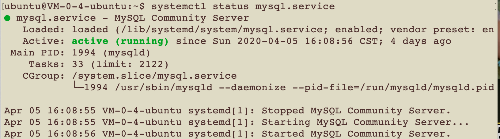

# Ubuntu 18.04安装配置Mysql

安装和配置总是十分复杂的，而且情况也因人而异。记下我的配置过程。 环境：Ubuntu 18.04 LTS

### 安装MYSQL

```text
#更新源
sudo apt-get update
#下载安装mysql
sudo apt-get install mysql-server
```

### 初始化配置

进入初始化的安全配置

```text
sudo mysql_secure_installation
```

下面会进行六项配置，可以根据自己的情况进行

```text
#1
VALIDATE PASSWORD PLUGIN can be used to test passwords...
Press y|Y for Yes, any other key for No: N (我的选项)

#2
Please set the password for root here...
New password: (输入密码)
Re-enter new password: (重复输入)

#3
By default, a MySQL installation has an anonymous user,
allowing anyone to log into MySQL without having to have
a user account created for them...
Remove anonymous users? (Press y|Y for Yes, any other key for No) : N (我的选项)

#4
Normally, root should only be allowed to connect from
'localhost'. This ensures that someone cannot guess at
the root password from the network...
Disallow root login remotely? (Press y|Y for Yes, any other key for No) : Y (我的选项)

#5
By default, MySQL comes with a database named 'test' that
anyone can access...
Remove test database and access to it? (Press y|Y for Yes, any other key for No) : N (我的选项)

#6
Reloading the privilege tables will ensure that all changes
made so far will take effect immediately.
Reload privilege tables now? (Press y|Y for Yes, any other key for No) : Y (我的选项)
```

接下来检查一下mysql服务的状态

```text
systemctl status mysql.service
```

如果看到了绿色的runing证明就没有问题 



### 配置远程访问

远程访问要干的几件事情：首先在服务器端修改bind-address，使得mysql可以接受到其他主机的访问；接下来设置一个用户并赋予权限，使其可以对数据库进行读写。

#### 修改bind-addresss

进入mysql的配置文件

```text
sudo vim /etc/mysql/mysql.conf.d/mysqld.cnf
```

这个文件下找到如图的位置，在bind-address前面打上注释，或者将ip修改为0.0.0.0就表示可以允许所有主机的访问，当然如果想安全一点，可以绑定到一个特定的ip。 


值得关注的是其他的几个位置，在这个文件中提及到了错误日志的位置，要记住，在使用中可能经常会回来看。


#### 创建用户并赋予权限

进入数据库，直接root进入就可以

```text
sudo mysql
```

下面语句用来创建用户，`*.*`的第一个`*`表示数据库名，如果是`*`表示所有，后面的`*`表示该数据库中的表。`root`是用户名称，可以自定义，`localhost`改为你自己想使用的的ip

```text
##1 创建数据库
CREATE DATABASE db;
##2 创建用户wxx(密码654321) 并允许wxx用户可以从任意机器上登入mysql的weixx数据库
GRANT ALL PRIVILEGES ON db.* TO user@“%” IDENTIFIED BY "654321";
```

最后要刷新权限 成功后要输入以下代码重新加载权限

```text
flush privileges;
```

### 可能遇到的问题

在上述之后可能还是会碰到问题，那么这里给出几个问题的解决方案

#### mysql  ERROR 1044 access denied user权限

未赋予用户权限，将mysql/user表中的权限进行修改

```text
UPDATE mysql.user SET Grant_priv=‘Y’,Super_priv=‘Y’ where User=‘yourname’;
```

#### mysql配置文件无权限修改

这里碰到的情况是`mysqld.cnf`这个文件是只读的，无法修改。因此需要暂时的修改权限。

```text
sudo chmod 777 mysqld.cnf
```

操作完后记得改回来，否则无法生效。

```text
sudo chmod 644 mysqld.cnf
```

重启mysql服务即可。

