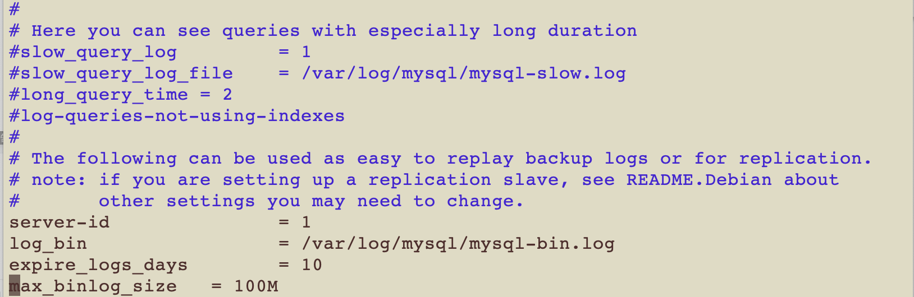

# Ubuntu 18.04配置MySql主从

环境：主机+腾讯云服务器 Ubuntu 18.04 LTS、mysql 5.7

配置主从有三个步骤：如果当前的主数据库上已经有了一些数据，那么应该将主数据库上的数据导出到从数据库；接下来设置主数据库配置；最后配置从服务器。

这里我们的主服务器ip是ipa，从服务器ip为ipb，要同步的数据库为test。

### 导出已有数据

如果你的主数据库是新的，那么可以跳过这一步直接看主数据库配置。

首先是给要同步的数据库加锁

```text
mysql>use test;
mysql>flush tables with read lock;
```

然后在bash下

```text
mysqldump -uroot -p -hlocalhost > mysql.bak.sql
```

将sql传给你的从服务器

```text
scp mysql.bak.sql root@ipb:/tmp/
```

```text
mysql> stop slave;
```

然后到从库执行mysql命令，导入数据备份

```text
mysql> source /tmp/mysql.bak.sql
```

### 配置主服务器

首先修改mysql配置文件 找到下面的位置，将server-id置1。 



接下来在创建一个新的用户，给予它同步的权限

```text
mysql> create user 'repl'@'ipb’ identified by ‘pass’;
mysql> GRANT REPLICATION SLAVE ON *.* TO 'repl’@‘ipb’;
```

重启mysql服务后可以查看状态

```text
show master status
```

注意这个时候会出现两个字段`MASTER_LOG_FILE`,`MASTER_LOG_POS`。这个要记住，在配置从服务器的时候要用。

### 配置从服务器

同样修改配置文件，将server-id改为2

```text
#server-id给数据库服务的唯一标识
server-id=2
#read_only设置数据库为只读，防止从库数据修改后，主从数据不一致，但是有Super权限的账号还是有写的权限，所以要某个账号只读的话，可以去掉账号的Super权限
read_only=1

#指定需要同步的表
replicate-wild-do-table=ljzxdb.%
#binlog_cache_size此参数表示binlog使用的内存大小
binlog_cache_size=1M
```

接下来连接主库，最后两个字段填我们从主库得到的。

```text
mysql> CHANGE MASTER TO MASTER_HOST=‘ipa’, MASTER_USER='repl', MASTER_PASSWORD=‘pass’, MASTER_LOG_FILE=‘‘, MASTER_LOG_POS=;
```

接下来启动服务

```text
mysql> start slave;
```

我们可以看一下状态

```text
mysql>show slave status\G
```

如果看到了`Slave_IO_Running`和S`lave_SQL_Running`都是Yes，那么就ok了。

### 主从未发生同步

我们这里犯了一个错误，一开始没有将从数据库设置为只读，因此不小心写入了数据，导致了同步错误。为了保证数据的全部一致，需要重新做一遍主从。注意这时主数据库已经有数据了，所以要先将sql日志导入给从数据库,也就是本文的第一步，接下来直接设置从库

设置从库同步，注意该处的同步点，就是主库show master status信息里的\| File\| Position两项 ，所有的同步会在当前pos之后开始。

```text
change master to master_host = ‘ipa’, master_user = ‘repl’, master_port=3306, master_password=‘pass’, master_log_file = ‘’, master_log_pos=;
```

重新开启从同步

```text
mysql> stop slave; 
mysql> start slave;
```

查看同步状态

```text
mysql> show slave status\G
```

