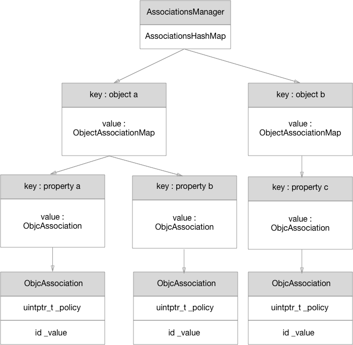

# 频控问题

### 背景

客户端有时监听了若干状态。比如不同的VIP状态等，在每次监听改变的时候可能需要重新向后端发请求。这样可能产生的情况是，当某个状态发生改变的时候，多个地方都会监听到，这样可能导致短时间内发出大量相同请求。后端可能进行了频控，这样就会导致拿不到数据展示错误的样式。

### debounce & Throttle

前端可能会经常使用的两个方法：防抖和节流。可以在这个场景内去使用。

debounce方法的作用是，在触发方法后的一段时间内，才真正的调用方法。如果在等待的时间内重新有新的触发，那么就会重新计算时间。Throttle方法的作用是，在一段时间内对方法的触发会压缩为一个。

在这个情况下，我们可以使用throttle的方法，在一段时间内的响应，只发送一个请求。

### 实现

#### RxSwift

有两种实现的方法。因为项目是用swift开发的，可以直接引入RxSwift库，[GitHub - ReactiveX/RxSwift: Reactive Programming in Swift](https://github.com/ReactiveX/RxSwift)。

```swift
    private let vipChangePublishSubJect = PublishSubject<Void>()
    private let disposeBag = DisposeBag()

        vipChangePublishSubJect
            .debounce(.milliseconds(200), scheduler: MainScheduler.instance)
            .subscribe {[weak self] (_) in
                     //action
            }.disposed(by: disposeBag)
```

在我们当前的业务场景下，这不见得是非常好的一种做法。使用这种方法意味着要在每一个业务场景去进行单独的设置，这样显然是不好的做法。在我们的业务中，会发生频控的原因在于，业务场景需要监听权益的变化，在权益变化的时候发送请求对用户看到的内容进行刷新。权益本身的变化可能有多个，其中的一个权益内容发生变化可能会重新发送一次请求。最好的做法是，我们在源头，也就是在监听权益内容的地方进行限流。

#### 自己实现

自己实现一个debounce方法。这里有意思的一点在于，虽然说的是debounce方法，但实际上却是Throttle。本质上是将一段时间内的方法触发delay，这段时间内对方法的额外触发将不会重新的触发方法。

要实现这个方法，我们可以使用`Dispatchworkitem`来实现。本质思路是，因为可能涉及到多个权益切换的监听，每一种切换可能发送出去不同的请求。因此要对不同的切换进行不同的响应。因此还需要使用associate进行关联。

```swift
private func vipChangeDebounce() -> DispatchWorkItem {
        let workItem: DispatchWorkItem? = getAssociated(associatedKey: &Key)
        if let result = workItem {
            result.cancel()
            return result
        } else {
            let workItem: DispatchWorkItem = DispatchWorkItem(block: { [weak self] in
                delay(0.2){
                    //action
                    self?.removeAssociated(associatedKey: &BNVipChangeAssociatedKey)
                }
            })
            setAssociated(value: workItem, associatedKey: &Key, policy: .OBJC_ASSOCIATION_RETAIN)
            return workItem
        }
    }
```

这里要注意两个坑。首先是在获取到关联值之前，一定要取消掉前面一次的任务。不然完全就不能起到限流的作用。第二点在于，每次执行完任务之后，一定要remove掉关联值。否则这个关联值在内存中会一直存在，之后的所有操作就会无效。

另外要注意的一点是，设置关联值本质上是一个OC方法。因此所有使用该方法的类有一定要是NSObject类型。

### objc\_setAssociatedObject

我们来看一下关联值这个方法。让一个对象和另一个对象关联起来，即一个对象保持对另一个对象的引用，并可以获取这个对象。关键字是一个void类型的指针。每个关键字必须是唯一的，通常都是会采用静态变量来作为关键字。

```objectivec
/** 
 * Sets an associated value for a given object using a given key and association policy.
 * 
 * @param object The source object for the association.
 * @param key The key for the association.
 * @param value The value to associate with the key key for object. Pass nil to clear an existing association.
 * @param policy The policy for the association. For possible values, see “Associative Object Behaviors.”
 * 
 * @see objc_setAssociatedObject
 * @see objc_removeAssociatedObjects
 */
@available(iOS 3.1, *)
public func objc_setAssociatedObject(_ object: Any, _ key: UnsafeRawPointer, _ value: Any?, _ policy: objc_AssociationPolicy)
```

在oc中，关联对象是runtime的一个特征体现。oc使用一张全局表去记录关联的key和value。

 



* 所有的关联对象都由一个**AssociationsManager**对象来管理，这个对象里面有一个**AssociationsHashMap**。
* **AssociationsHashMap**由许多key-value构成。key是对象的地址；value是一个**ObjectAssociationMap**，也就是所谓的关联对象。
* **ObjectAssociationMap**就是关联对象，每个关联对象里面包含多个key-value对。key是属性名；value是**ObjcAssociation**，也就是相当于属性对应的实例变量。
* **ObjcAssociation**相当于实例变量，该结构体有两个成员：**\_policy** 属性的内存管理语义；**\_value** 属性的值

