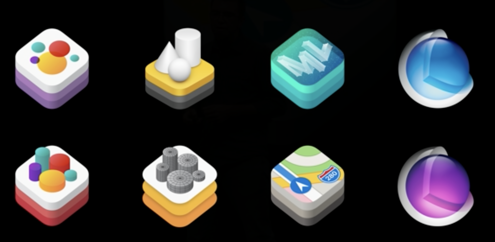
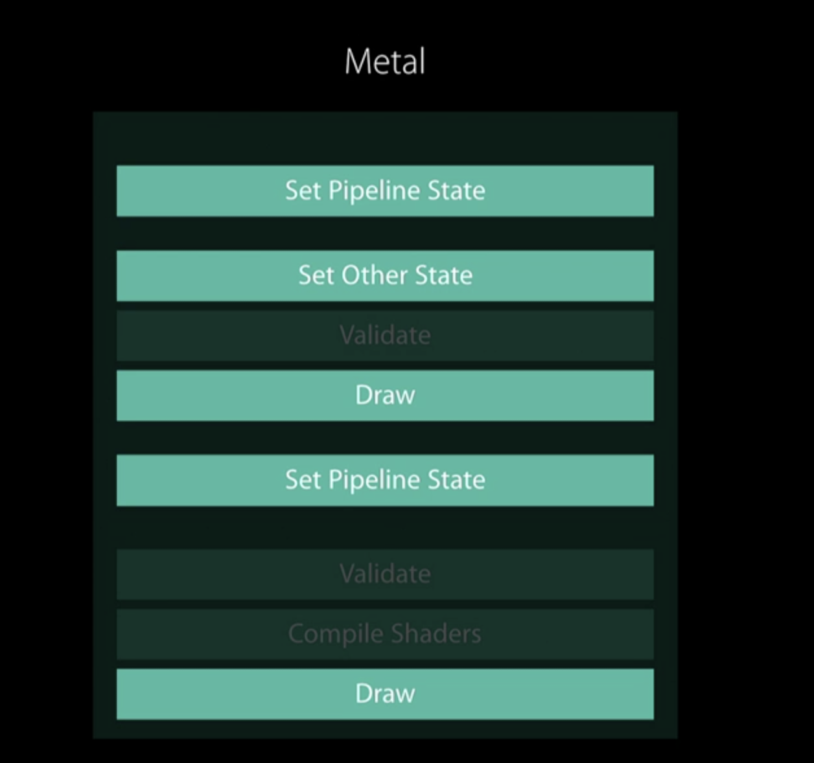
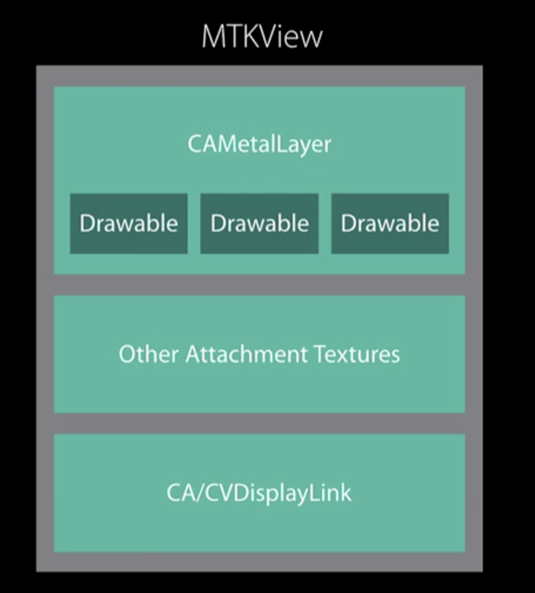
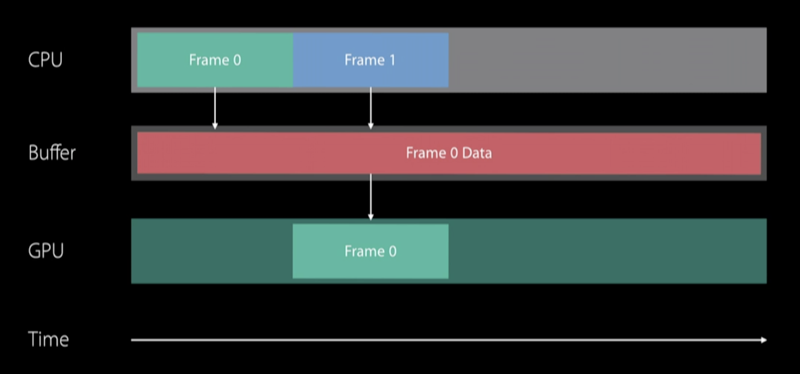
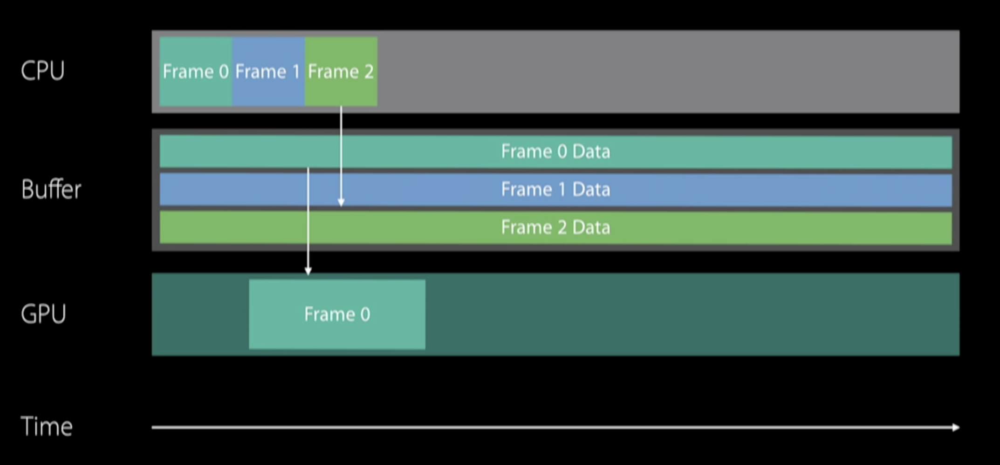
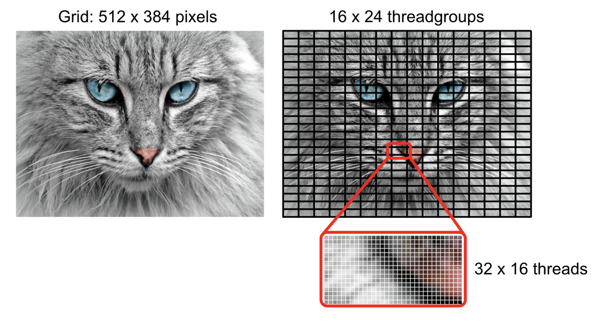

# 通过Playground玩Metal

### 总览

2013年AMD发起了Mantle Project，这是一套自研的底层渲染API，对标Direct3D和OpenGL。Mantle承诺可以将渲染的速度提升9倍，并且支持异步的处理。但很快directX12就发布并且可以提供类似的功能，Mantle在开发时遇到的bug也更多，因此很快就夭折了。

2014年Apple推出了metal，底层的GPU API。很快相继推出了MetalKit和MSL，并且在之后每一年的WWDC上都有更新。相比于opengl，他有更高的GPU使用率，更低的CPU占有，支持异步操作，也支持多线程。

在笔者看来，除了对apple底层更适配之外，Metal的主要优势在两个

* 没有缓冲区和texture的复制，可进行CPU和GPU的同步访问
* Do expensive move less often，预估GPU来避免多余的验证和计算

  我们在之后会通过几个playground来阐述上面两个优势

#### 什么样的场景适合使用metal

Apple的核心框架一直在采用metal，即使有些曾经基于OpenGL的，也在2018年后逐渐的向Meta迁移。如果你正在使用spritekit、scenekit、CA、CI、realitykit那么其实已经开始使用metal了。

如果你是OpenGL的开发者，并且想要迁移到Metal，可以观看下面的视频 [Bringing OpenGL Apps to Metal - WWDC 2019 - Videos - Apple Developer](https://developer.apple.com/videos/play/wwdc2019/611/)



在游戏、专业图片处理、专业绘图处理，机器学习方向都可使用Metal。总结下来说，有以下需求的时候可以使用：

* 高效的渲染3d模型
* 需要使用自定义的管线或者着色器
* 大量的数据计算
* 大量密集的数据处理，比如音视频或者图片的处理

我们会首先通过一个基本的渲染流程，熟悉Metal相关的属性和方法；接下来通过一些编写好的Metal Shader程序来了解Metal的部分特性和高级用法；最后会以最佳实践的tips作为总结。所有的程序均在playground中实现。

### 基本渲染流程

#### device

Metal的渲染是从获取device开始的。

```swift
letdevice=MTLCreateSystemDefaultDevice()
```

`MTLDevice`是一套来访问GPU的接口，实际上就是一个抽象的GPU。由device可以继续构造出后面使用的Texture、Buffer、以及Pipeline。 开发时可以选择自己要使用的GPU，对于iOS，GPU只有一块；对于macOS可以有多块显卡，因此可以去选择显卡。 可以通过以上方法来创建device，也可以通过下面的方法来获得所有的GPU。

```swift
funcMTLCopyAllDevices()->[MTLDevice]
```

在整个运行的过程中，保持对一个对象的引用即可，无需重复的创建。

#### Buffer

现在要把计算好的值放在buffer里，这样GPU可以直接读取到。Buffer是一块用来存储任何格式数据的内存，可以是顶点数据、索引数据、常量等等。把数据写到buffer里，随后在顶点着色器和片源着色器内部去读取调用。 比如我们可能会建立一个顶点buffer，内部具体存储的数据可以是swift结构。用向量来表示顶点的位置。可以通过以下的方法来获得一个指定大小的缓存，缓存内默认是空的。或者通过第二个方法获得已有的缓存的指针，copy到一块新的内存中。（或者使用`memcpy`也是可以的）

```swift
letbuffer=device.makeBuffer(length:Int,options:MTLResourceOptions)

letbuffer=device.makeBuffer(bytesNoCopy:UnsafeMutableRawPointer,length:Int,options:MTLResourceOptions,deallocator:(UnsafeMutableRawPointer,Int)->Void)?)
```

#### MTLLibrary

Metal会直接把着色器编译到程序包中，只要存在一个`.metal`文件，就会在编译器产生`defalut.metallib`文件，直接拷贝到程序包里面去。很自然的一个问题是，如果从lib中拿到这些方法？ 通过`MTLLibrary`。`MTLLibrary`包含MSL的源码，是编译好的方法的集合。可以有以下几种方法创建

* 通过上述的流程创建`default.metalib`，在运行时从`default.metalib`加载
* 通过xcode tool chain创建lib
* 在运行时通过source stirng创建

```swift
funcmakeDefaultLibrary()->MTLLibrary?//返回一个默认的Library
funcmakeLibrary(filepath:String)throws->MTLLibrary//在指定位置创建
funcmakeLibrary(data:__DispatchData)throws->MTLLibrary//从一个预编译为二进制的lib中创建
funcmakeLibrary(source:String,
options:MTLCompileOptions?,
completionHandler:@escapingMTLNewLibraryCompletionHandler)//运行时创建，通过异步的编译一个特定的字符串
```

在HelloWorld中，我们选择了在运行时通过sourcestring的方式进行创建。后面的playground我们通过defalutlib来创建。

```swift
letshader="""
#include<metal_stdlib>usingnamespacemetal;
structVertexIn{
float4position[[attribute(0)]];
};
vertexfloat4vertex_main(constVertexInvertex_in[[stage_in]]){
returnvertex_in.position;}
fragmentfloat4fragment_main(){
returnfloat4(1,0,0,1);
}
"""
```

现在我们有了lib，从中拿到的也就是`MTLFunction`。`MTLFunction`和渲染的阶段关联很强，加载的方式也是通过名称进行加载

* `vertex`
* `fragment`
* `kernel`（并行数据的计算）

```swift
let lib=trydevice.makeLibrary(source:shader,options:nil)
let vertexFunction=lib.makeFunction(name:"vertex_main")
let fragmentFunction=lib.makeFunction(name:"fragment_main")
```

#### Pipeline

这里就回到了我们之前提到的特性，Metal可以将GPU的状态进行预估，从而减少在绘制过程的消耗。我们先回到OpenGL的渲染过程。


像OpenGL中的API，经常需要设置许多状态。然后触发drawcall，在这之间驱动负责验证设置的状态是有效的，在最坏的情况下，还得付出运行时重新编译着色器的代价。相较而言，Metal就简单了许多：



`RenderPipelineState`代表GPU的管线配置。它包括你会在加载时创建的一个预验证集合。`RenderPipelineStates`是持久对象，它在你的整个程序生命周期都存在。

实际上在创建`RenderPipelineState`时我们不会直接创建，反而我们会用一个叫做`Descriptor`的对象。它打包了所有参数用来创建`RenderPipelineState`。这点在Metal中体现的比较多，如果一个对象是持久的，那么他往往不会直接创建，而是通过描述符的形式创建。通常在Metal中我们创建`Descriptor`对象，它会把所有不同的参数聚合在一起，在创建其他对象时可能也会使用。

对于`RenderPipelineState`对象，我们会发现它包含指向顶点函数和片段函数的指针。它还包含一个attachment集合，attachment是一些纹理。现在在Metal中所有的渲染都会被渲染到纹理中，我们只需要提供要渲染的像素格式，这样metal会对它们的管线状态优化。

一个最小化配置的管线至少包括以下三个部分

* 顶点着色器
* 片源着色器
* 颜色的编码格式

```swift
letdescrioptor=MTLRenderPipelineDescriptor()
descrioptor.colorAttachments[0].pixelFormat=.bgra8Unorm
descrioptor.vertexFunction=vertexFunction
descrioptor.fragmentFunction=fragmentFunction
descrioptor.vertexDescriptor=MTKMetalVertexDescriptorFromModelIO(mesh.vertexDescriptor)
```

最后通过描述符创建一个`pipelinestate`，一个state代表了一个编译好的渲染管线。

```swift
letpipelineState=trydevice.makeRenderPipelineState(descriptor:descrioptor)
```

#### MTKView



所有的metal绘制在一个特殊的view上即`MTKView`。继承自`UIView` iOS / `NSView` macOS。`MTKView`会创建和管理一个`CAMetalLayer`，后者会来管理用户界面的交互。`CAMetalLayer`同时管理`drawable`资源，这些是可以绘制的资源的集合。绘制资源包含的是可以绘制到屏幕上的`texture`。这些在一个内部的队列中保存，会在帧间复用。因为它们相对来说要耗费资源。因此由系统管理。

```swift
view.clearColor = MTLClearColorMake(1.0, 1.0, 1.0, 1.0)
view.colorPixelFormat = .bgra8Unorm
view.depthStencilPixelFormat = .a8Unorm
view.delegate = render
```

我们可以设置这些基本属性，最后一个相对重要一点，因为`MTKView`不会自己做绘制，所以需要一个代理来做绘制。代理基本上要实现的方法有两个：

```swift
func mtkView(_ view: MTKView, drawableSizeWillChange size: CGSize){
    //respond to size change
}

func draw(in view: MTKView) {
    let commandQueue = device?.makeCommandQueue()
    let commandBuffer = commandQueue?.makeCommandBuffer()
    //do something nice
    commandBuffer?.commit()
}
```

* `drawableSizeWillChange`。第一个方法负责响应在窗口发生的变化。比如设备旋转。他会重新计算投影矩阵然后重绘所有的帧。
* `draw`。这个方法会被固定的调用，基本的模版列举在上面，你需要创建`commandbuffer`，将一些绘制的指令塞进去，接下来`commit`所有的指令。为了方便管理buffer，还可以使用一个`commandQueue`来进行管理。

#### Command Submission Model

`commandBuffer`不同于之前介绍的缓存，其存储的不是数据而是要提交给GPU的指令。并且`commandbuffer`的创建和使用在开发者的掌控之中。 `commandQueue`是是用来管理`commandBuffer`的。Queue是一个持久的对象，在整个程序的生命周期保持对其的引用即可。`commandBuffer`却是暂时的，每一帧需要创建一个或多个。向buffer里编码，buffer提交给GPU，buffer脱离queue，他的生命周期会自己结束。

通过encoder向commandbuffer里面填充指令。它存在目的是将单次的render pass翻译成GPU可以执行的指令，内部包含的是一个attachment的集合，代表的是要绘制的纹理。encoder有三种不同的类型：

* render 用于设置绘制状态和发起draw call
* compute 将工作上传到GPU并行计算
* blit 在缓存和texture之间传输传输数据

  并且这其中是不存在为了验证状态而有的延时，因为所有的状态已经在最初的state中就已经设置好了。

创建encoder要通过`renderpassdescriptor`，它内部包含的就是多个attachment。

```swift
open class MTLRenderPassDescriptor : NSObject, NSCopying {
    open var colorAttachments: MTLRenderPassColorAttachmentDescriptorArray { get }
    @NSCopying open var depthAttachment: MTLRenderPassDepthAttachmentDescriptor!
    @NSCopying open var stencilAttachment: MTLRenderPassStencilAttachmentDescriptor!
```

```swift
guardletcommandQueue=device.makeCommandQueue()else{
fatalError("oops")
}
```

当然这一切可以变得更简单，让你来绘制当调用到view的时候，view会提供一个`MTLRenderPassDescriptor`，接下来可以直接创建enconder。获取这个参数是一个潜在的block操作，在获取`currentRenderPassDescriptor`的时候会去寻找下一个可用的drawable资源，但是这个资源是有限的，因此在没有可以使用的资源时会阻塞。

#### render

一切就绪的时候，就可以开始发起drawcall，通过调用`drawIndexedPrimitives`方法。最后结束编码

```swift
renderEncoder.drawIndexedPrimitives(type:.triangle,indexCount:submesh.indexCount,indexType:submesh.indexType,indexBuffer:submesh.indexBuffer.buffer,indexBufferOffset:0)

renderEncoder.endEncoding()
```

#### Present

虽然渲染完了，但是还没有展示到屏幕上。这是只需要`commandBuffer`调用方法，最后commit提交给GPU即可。

```swift
guardletdrawable=view.currentDrawableelse{
fatalError()
}

commandBuffer.present(drawable)
commandBuffer.commit()
```

### 管理动态数据

管理动态数据，就是每一帧都在变化的大量数据。绘图操作可能是下面这样：

```swift
func draw(){
    updateObjects()
    drawObjects()
    submitGPUCommands()
}
```

这样带来的问题就是发起draw call的瓶颈。我们可以将所有的数据都存储起来，当发起draw call的时候可以直接读取，甚至还可以重复的使用数据。

实现的方法是采用一个`constantBuffer`，内部存储渲染每一帧的所有数据，每一次的draw call会返回一个偏移量，来代表当前draw call具体使用的是哪一块数据。一个具体的实现流程如下：

```swift
// Write the shadow pass data into the constants buffer
constantBufferForFrame.contents().storeBytes(of: shadowPassData[0], toByteOffset: shadowOffset, as: ShadowPass.self)

// Write the main pass data into the constants buffer
constantBufferForFrame.contents().storeBytes(of: mainPassFrameData, toByteOffset: mainPassOffset, as: MainPass.self)

// Create a mutable pointer to the beginning of the object data so we can step through it and set the data of each object individually
var ptr = constantBufferForFrame.contents().advanced(by: objectDataOffset).bindMemory(to: ObjectData.self, capacity: objectsToRender)
```

这样带来的另一个问题是，CPU和GPU会读取同一块内存，可能就会产生竞争。

#### GPU CPU同步



GPU使用buffer内的数据的时候，CPU对此毫不知情，因此此时重写就会导致问题。

我们可以通过回调+信号的方式来解决，当计划将指令发送给GPU的时候调用`addScheduledHandler`，当GPU操作完成的时候调用`completion`，这个时候修改和销毁就是安全的。

理想的情况下，我们希望GPU和CPU同步的进行，通过使用一个缓冲池来解决这个问题。缓冲池的大小要根据每个app内部来进行判断。



```swift
mainCommandBuffer.addScheduledHandler { scheduledCommandBuffer in
            self.gpuTiming[Int(currentFrame % 3)] = mach_absolute_time()
        }

        mainCommandBuffer.addCompletedHandler { completedCommandBuffer in

            let end = mach_absolute_time()
            self.gpuTiming[Int(currentFrame % 3)] = end - self.gpuTiming[Int(currentFrame % 3)]

            let seconds = self.machToMilliseconds * Double(self.gpuTiming[Int(currentFrame % 3)])

            self.runningAverageGPU = (self.runningAverageGPU * Double(currentFrame-1) + seconds) / Double(currentFrame)

            self.semaphore.signal()
        }
```

### Dive into playground

通过上面一个流程，我们就可以实现第一个playground，绘制一个简单的圆形。接下来的几个playground会依次的展示动画、光线追踪、shadow和如何使用MPS处理图片。我们会挑两个部分，结合代码进行描述。

#### 动画

创造动画的一个非常好用的元素是粒子。这是一个很小的图形对象，也只携带了最基本的一些数据：颜色、位置、时间、速度和方向。但是可以创造出许多不同的效果

* 人物：头发、布料
* 自然效果：光、雾、水、烟
* 科幻效果

在这个playground中，我们用一个粒子实现的烟花效果来说明如何使用计算管线，以及多通道的渲染。

**Emitter**

首先是创建一个粒子发生器。在其中定义粒子的结构，

```swift
struct Particle {
  var position: float2
  var direction: Float
  var speed: Float
  var color: float3
  var life: Float
}
```

在初始化时为每一个粒子设置基本属性。同时为了效果，通过一个loop来让粒子的效果变得随机。

```swift
let position = float2(Float.random(in: 0...width),
                          Float.random(in: 0...height))
    let color = float3(Float.random(in: 0...life) / life,
                       Float.random(in: 0...life) / life,
                       Float.random(in: 0...life) / life)

    for _ in 0..<particleCount {
      let direction = 2 * Float.pi * Float.random(in: 0...width) /
      width
      let speed = 3 * Float.random(in: 0...width) / width
      pointer.pointee.position = position
      pointer.pointee.direction = direction
      pointer.pointee.speed = speed
      pointer.pointee.color = color
      pointer.pointee.life = life
      pointer = pointer.advanced(by: 1)
    }
```

我们希望放一个烟花簇，但同时也要限制一个屏幕上展示的emmiter不要太多，因此在update方法中使用一个计数器，每次达到threshold就remove一个emmiter

**computePipeline**

这里建立的是一条计算管线，我们可以大概看一下这两个协议的区别

```swift
public protocol MTLRenderPipelineState : NSObjectProtocol {

    var label: String? { get }
    var device: MTLDevice { get }

    @available(iOS 11.0, *)
    var maxTotalThreadsPerThreadgroup: Int { get }

    @available(iOS 11.0, *)
    var threadgroupSizeMatchesTileSize: Bool { get }

    @available(iOS 11.0, *)
    var imageblockSampleLength: Int { get }

    @available(iOS 11.0, *)
    func imageblockMemoryLength(forDimensions imageblockDimensions: MTLSize) -> Int

    @available(iOS 12.0, *)
    var supportIndirectCommandBuffers: Bool { get }
}

open class MTLComputePipelineDescriptor : NSObject, NSCopying {

    open var label: String?

    open var computeFunction: MTLFunction?

    open var threadGroupSizeIsMultipleOfThreadExecutionWidth: Bool

    @available(iOS 12.0, *)
    open var maxTotalThreadsPerThreadgroup: Int

    @available(iOS 10.0, *)
    @NSCopying open var stageInputDescriptor: MTLStageInputOutputDescriptor?

    @available(iOS 11.0, *)
    open var buffers: MTLPipelineBufferDescriptorArray { get }

    @available(iOS 13.0, *)
    open var supportIndirectCommandBuffers: Bool

    open func reset()
}
```

计算管线不持有任何图形的数据，实际上操作会更简单。不需要描述符就可以进行初始化。并且注意是从一个kernel方法初始化的，这也是metal shader提供的 ~~最后~~ 一个同级关键字。

> 事实上在WWDC20中Meta新增了关键字`[[visible]]`用于声明函数指针，具体的内容可以看下面的视频和文章：  
> [Get to know Metal function pointers - WWDC 2020 - Videos - Apple Developer](https://developer.apple.com/videos/play/wwdc2020/10013/)  
> [WWDC20 10013 - Get to know Metal function pointers － 小专栏](https://xiaozhuanlan.com/topic/1872495036)

在计算管线的draw方法里会做一个不同的处理，渲染管线中需要设置着色器方法，更新每个object的状态。但在计算管线里面我们需要设置怎么去设置GPU的线程。



使用`dispatchThreads`这个方法，通过传入两个MTLSize类型的数据，来对整体要处理的数据进行划分。这个width可以自行设置，apple建议最好使用内部的数据来初始化，threadExecutionWidth代表了能最多支持多少个线程并行

```swift
guard let computeEncoder = commandBuffer.makeComputeCommandEncoder()
            else { return }
        computeEncoder.setComputePipelineState(pipelineState)
        computeEncoder.setTexture(drawable.texture, index: 0)
        var width = pipelineState.threadExecutionWidth
        var height = pipelineState.maxTotalThreadsPerThreadgroup / width
        let threadsPerThreadgroup = MTLSizeMake(width, height, 1)
        width = Int(view.drawableSize.width)
        height = Int(view.drawableSize.height)
        var threadsPerGrid = MTLSizeMake(width, height, 1)
        computeEncoder.dispatchThreads(threadsPerGrid,
                                       threadsPerThreadgroup: threadsPerThreadgroup)
        computeEncoder.endEncoding()
```

**双pass**

我们有一个pass去计算背景，用另一个去计算烟花。为此我们额外的生成一条pipelinestate。在它对应的encoder中设置对应的buffer数据。


```swift
 guard let particleEncoder = commandBuffer.makeComputeCommandEncoder()
            else { return }
        particleEncoder.setComputePipelineState(particlePipelineState)
        particleEncoder.setTexture(drawable.texture, index: 0)
        threadsPerGrid = MTLSizeMake(particleCount, 1, 1)
        for emitter in emitters {
            let particleBuffer = emitter.particleBuffer
            particleEncoder.setBuffer(particleBuffer, offset: 0, index: 0)
            particleEncoder.dispatchThreads(threadsPerGrid,
                                            threadsPerThreadgroup: threadsPerThreadgroup)
        }
        particleEncoder.endEncoding()
```

#### MPS

Metal Performance Shaders是一系列高性能的计算模块和shader的框架。这些内置的方法均经过了优化，可以很好的利用GPU的特性。可以用在以下的场景：

* 高性能的图像处理
* 神经网络计算
* 复杂数值计算（矩阵、向量等）
* 光线追踪

  我们可以通过边界探测的shader来看这个流程。使用MPS我们并不需要创建渲染管线，MPS已经将渲染的数据进行了设置，只需要向commandBuffer内填充命令即可。

  ```swift
  let shader = MPSImageSobel(device: device)
  shader.encode(commandBuffer: commandBuffer, sourceTexture: texIn,destinationTexture: drawable.texture)
  commandBuffer.present(drawable)
  ```

  MPS内部的方法对于开发者来说是黑盒，支持的滤镜大致有以下几类：

* 形态筛选：area min、area max
* 卷积：高斯模糊、sobel边缘检测
* 直方图
* 阈值：binary binary inverse

  关于MPS可以做什么具体可以参考这里👉[image filters](https://developer.apple.com/documentation/metalperformanceshaders/image_filters)

### Tips

最后我们聊一聊使用Metal的最佳实践Tips。

#### 资源管理

**持久化的对象**

* 在程序开始的时候建立device、commandQueue。这些都是只需建立一次的对象。Apple建议每一块GPU建立一个device和queue
* 在编译期就编译好方法和lib，wwdc20提供了新的函数指针，可以在编译期动态的调用
* 建立的管线尽可能的复用

**存储**

```swift
typedef NS_ENUM(NSUInteger, MTLStorageMode)
{
    MTLStorageModeShared  = 0,
    MTLStorageModeManaged API_AVAILABLE(macos(10.11), macCatalyst(13.0)) API_UNAVAILABLE(ios) = 1,
    MTLStorageModePrivate = 2,
    MTLStorageModeMemoryless API_AVAILABLE(ios(10.0)) API_UNAVAILABLE(macos, macCatalyst) = 3,
} API_AVAILABLE(macos(10.11), ios(9.0));
```

对于iOS和tvOS，shared模式定义的内存可以被CPU和GPU访问，Private只能被GPU访问。

**三缓冲**

三缓冲也是为了解决掉帧问题。ios手机自己开启了垂直同步和双缓冲，但是会以掉帧为代价，三缓冲合理的使用了CPU、GPU渲染性能，减少掉帧的次数。

#### 显示

drawable是相对昂贵的资源，他们存在在一个有限的资源池中，当程序调用时如果没有可用的drawable资源，线程就会block直到有有可用的drawable。因此要尽可能的短的持有drawable。

* 尽可能晚的获取drawable，最好在encode一个通道之前再获取。动态数据的更新和计算提前先做好。
* 尽可能早的释放持有的drawable。在CPU上的work结束之后就释放。

  建议的方法还是直接使用MTKView，他提供一个currentDrawable和currentRenderPassDescriptor。后者引用了当前使用的drawable的材质。当调用到currentRenderPassDescriptor的时候，会隐式的获取当前帧的drawable。


#### 命令

**将多个encoder合并在一起**

将多个encoder合并在一起有助于减少带宽，但是合并encoder有着相对严苛的条件。但Metal API并没有提供自动合并的功能，因此这里的合并是手动的。合并Encoder的最终目的是合并drawcall。具体实施可以参考以下的标准：

* Encoder1和Encoder2在同一帧创建
* Encoder1和Encoder2从同一个CommadnBuffer创建
* Encoder1和Encoder2有着共同的渲染对象
* Encoder1和Encoder2有着严格的时序关系，并且中间没有其他的渲染命令

#### 编译期形成lib

着色器部分的代码的编译在整个metal的编译中十分昂贵，除非要在运行期动态的进行方法的编译，否则就在编译器完成lib的编译。

#### CoreImage + MPS

提起图像处理，想到的首先可能是Core Image。相对于Metal这类更底层的api，开发者应当首先使用更高层的框架。WWDC18之后，Apple为Core Image提供了CIImageProcessorKernel，这使得MPS可以集成到Core Image的使用中。开发者可以更灵活的去处理图像。 CoreImage的图像滤镜是逐像素的，这一点可以通过metal来实现。通过计算管线优化coreimage的通道。事实上CoreImage在每年的WWDC也有更新，metal也提供了优化Core Image通道的方法。 [Build Metal-based Core Image kernels with Xcode - WWDC 2020 - Videos - Apple Developer](https://developer.apple.com/videos/play/wwdc2020/10021/) [WWDC2020 - Core Image专题 － 小专栏](https://xiaozhuanlan.com/topic/0837629154)

### 写在最后

很开心你可以看到这里。我们通过5个playground对Metal进行了了解。

在`HelloWorld`中，我们了解了一个基本的Metal渲染流程；在`SimpleCircle`&`FireWork`中，我们了解了动画、计算管线和双通道渲染；在`water`中我们看到可以通过Metal实现的一些有趣的效果；最后在`MPS`中，我们了解了Metal Performance Shader以及他可以做到的cool things。

本文的内容参考自历年[All Videos - WWDC](https://developer.apple.com/videos/all-videos/)，[Metal By Tutorial](https://store.raywenderlich.com/products/metal-by-tutorials)。shader相关的内容参考[Inigo Quilez :: fractals, computer graphics, mathematics, shaders, demoscene and more](https://iquilezles.org/index.html)，在他的网站[Shadertoy BETA](https://www.shadertoy.com/)上有很令人启发的Shaders。

### 参考文献

[Metal Best Practices Guide: Resource Options](https://developer.apple.com/library/archive/documentation/3DDrawing/Conceptual/MTLBestPracticesGuide/ResourceOptions.html#//apple_ref/doc/uid/TP40016642-CH17-SW1)

 [Get to know Metal function pointers - WWDC 2020 - Videos - Apple Developer](https://developer.apple.com/videos/play/wwdc2020/10013/)

 [Adopting Metal, Part 1 - WWDC 2016 - Videos - Apple](https://developer.apple.com/videos/play/wwdc2016/602/)

[ Developer](https://developer.apple.com/videos/play/wwdc2016/602/)[Adopting Metal, Part 2 - WWDC 2016 - Videos - Apple Developer](https://developer.apple.com/videos/play/wwdc2016/603/)

