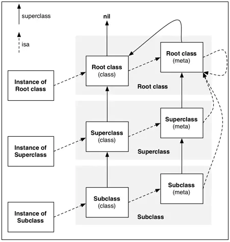

# 关于NSObject

将一个类翻到最底层，经常能看到继承的是NSObject，事实上，开发中经常使用到的类基本上都继承自它：`UIView`、 `UIViewController`、`UIImage`以及NS开头的系列。

NSObject是一个OC属性，OC底层是基于C/C++，因此涉及到底层的东西根据C的方式进行联系。

那么回到NSObject，官网的描述是大部分的OC class都继承于此。理解这是一个通用的对象，所有的其他对象是根据这个对象进行继承扩展。那么它究竟是个什么东西？NSObject可以指代很多其他东西，非常强的包容性，C系中可以实现此类结构的就是结构体。

接下来，我们可以把NSObject转换成C++的代码，可以看到里面实际上只有一个叫`isa`的指针，这个指针指向了内存中实际object的地址。因此可以这样理解：NSObject类中只有一个成员变量，就是指向底层中NSObject结构体的指针。

所以内存占用大小也可以知道了，但注意iOS平台上系统分配的内存大小都是16字节的倍数（此处存疑），macOS因为是64位，内存大小的分配时8字节。因此在对齐的时候也要注意。

每一个继承自object的类内部都有isa指针，这个指针会作为联系子类和父类的指针。当在一个实例中调用方法时，如果在实例中没有找到，会通过isa查找到父类，如果还没找到就逐级向上。

