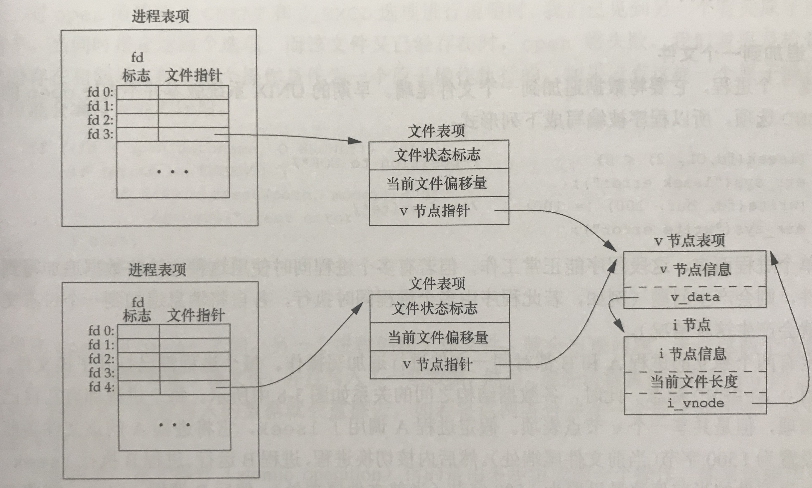

# APUE笔记 \| 文件和文件描述符

### 一切皆文件

“一切皆文件”是unix类系统的哲学思想。理解这个思想之前，我们应当先理解什么是文件。**文件是数据的组织**。这是我所理解的定义，当然显得十分的宽泛，如果再宽泛一点，也可以认为文件是一段字节。

一切皆文件，这个意义在于给予了一种抽象。对于我们往常认为是文件的东西，比如图片、文档、html等依然是文件；对于我们往常认为不是文件的东西，比如磁盘、IO设备、socket等，也可以作为文件处理。这意味着，对于你可以再计算机里面看到的所有东西，都可以使用同一组API来进行处理。

应当注意到，这背后所蕴含的一种思想和方法论。处理一个复杂问题，可以通过**抽象——找到原子操作**的方式来解决。对于unix的文件来说，原子操作就是read&write。类比开来，对于面向对象的语言来说，对象就是一种抽象，对象的构造、析构从本质上也是对象的原子操作。当我们设计一款数据库应用的时候，我们所有的操作本质还是增删改查，虽然这些操作本质上并不是原子操作，但在整体的逻辑上，我们可以这样认为。

### 文件描述符

文件是数据的组织。听上去就是一个比较难表达的东西。然而在计算机中我们常常需要去处理各种各样的文件。处理一个复杂的物体，你往往需要一个抓手。这里我们要说明一下文件描述符和文件句柄。

在多种情况下我们都听过这两个名词，windows中文件句柄占据了非常重要的位置。但是，我并没有在apue中找到对应的名词，仅仅是提到了文件描述符。为了理解这两个东西，我们首先看一下内核用于所有IO的数据结构。

内核在为每个用户维护的打开文件描述符表中，每个文件描述符占一项，同时还有指向文件表项的一个指针。这个指针指向了包含了各种该文件状态的数据结构。虽然文中并没有说明这个指针到底叫什么名字，不过我认为这个可以理解为unix中的文件句柄。即指向文件表项的指针。

到这里有必要清楚地区分一下两者的区别：**文件描述符是一个非负整数，计算机中的表示是无符号整数。他的意义在于索引，表示了该文件在当前进程的打开文件描述符表中的位置；而文件句柄是一个指针，他指向当前文件描述符表示的具体的文件表项。**

额外需要说明的一点，文件描述符的范围是0～OPEN\_MAX-1，很多系统将上限定为63。同时，unix系统shell将文件描述符0与标准输入关联、1与标准输出关联、2与标准错误关联。

### 文件共享和原子操作

了解了内核用于IO的数据结构，我们可以顺利的理解文件共享。事实上，他所做的就是将两个不同的文件描述符对应的文件句柄指向了同一块文件表项。

这样一来就自然的会发生并发问题。我们规定了几种原子操作。

* 追加到一个文件。这个操作如果不是原子的将分为两步：首先将文件的偏移量移到尾部，接下来进行写入的操作。需要注意的是，内核十分有可能在错误的时机挂起某项进程。比如a进程刚刚做好了转移偏移量的操作，然后突然地被挂起，b进程上台去执行完了自己的追加操作后，a进程再开始写入。这样就会覆盖掉b进程的操作。

  通过在文件上设置O\_APPEND标志，在每次进程写入之前，文件的偏移量都会定位到末尾。

* 创建一个文件。一般来说创建文件需要先open，如果失败，再create。呢么也有可能在这两个操作之间，另一个进程创建了这个文件。因此这个操作需要原子。

